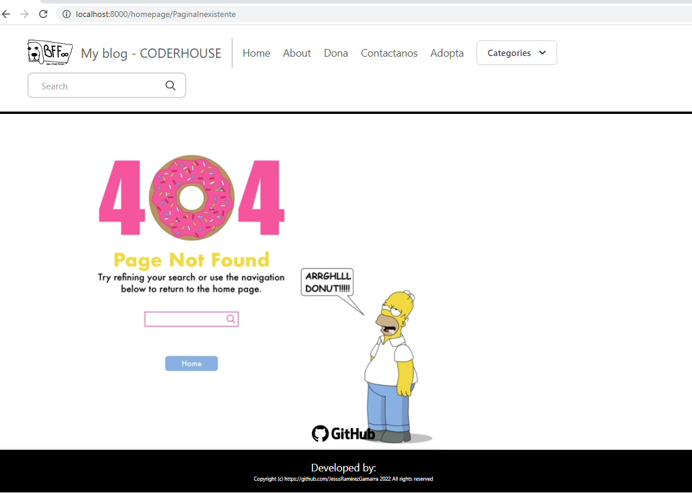

<p align="center">
  <p align="center">    
        
  </p>
  <p align="center">
       CoderHouse - Python [ver video](https://github.com/JesusRamirezGamarra/Django_TemplateWithSQL_intermediate/blob/main/public/media/https___jesusramirez.pythonanywhere.com.mp4)
  </p>
</p>

# CH - Django with SQL - Intermediate Python

<details><summary>
Challenge 01 - django MVT
</summary>
Para ingresara  la URL en vivo del proyecto hasta el 02/01/2023 : [Ingresa aqui](https://jesusramirez.pythonanywhere.com/)

>### Objetivos Generales:
Desarrollar una WEB Django con patrón MVT subida a Github.

>### Se debe entregar:
Link de GitHub con el proyecto totalmente subido a la plataforma.
Proyecto Web Django con patrón MVT que incluya:

1. Herencia de HTML. (detallado en el punto 8)
2. Por lo menos 3 clases en models.  (detallado en el punto 3)
3. Un formulario para insertar datos a todas las clases de tu models.  (detallado en el punto 14 ,15 y 16)
4. Un formulario para buscar algo en la BD  (detallado en el punto 9 y 10)
5. Readme que indique el orden en el que se prueban las cosas y/o donde están las  (detallado en el punto 1 al 16)
funcionalidades.


- Requerimientos :
    - asgiref==3.5.2
    - Django==4.1.2
    - importlib-metadata==5.0.0
    - Markdown==3.2.1
    - Pillow==9.2.0
    - pyclean==2.2.0
    - sqlparse==0.4.3
    - zipp==3.8.1

Nota : este desafio se cumplio con los pasos del 1 al 17 .
</details>


<p align="center">
  <p align="center">    
        
  </p>
  <p align="center">
       Blog - BFFs
  </p>
</p>


<details><summary>
Challenge 02 - django Entrega Final
</summary>
Para ingresara  la URL en vivo del proyecto hasta el xx/xx/xxx : [Ingresa aqui]()

>### Objetivos Generales:
Crear web similar a un blog

>### Se debe entregar:
Link de GitHub con el proyecto totalmente subido a la plataforma.
Proyecto Web Django con patrón MVT que incluya:

1. Se deberá realizar en  duplas o tríos, crearás una aplicación web estilo blog programada en Python en Django. Esta web tendrá admin, perfiles, registró, páginas y formularios.
2. La entrega se realizará enviando el link a GitHub, en el readme de Github deberá estar el nombre completo de los tres/dos participantes y una descripción de dos o tres renglones contando qué hizo cada uno.
3. En el github debe haber un video o link a vídeo donde nos muestran su web funcionando en no más de diez minutos. 
4. Dentro del Github deberá existir una carpeta con por lo menos 3 casos de pruebas debidamente documentados.
5. Contar con algún acceso visible a la vista de "Acerca de mí" donde se contará acerca de los dueños de la página manejado en el route about/.  (En castellano un “acerca de mí” que hable un poco de los creadores de la web y del proyecto).
6. Contar con algún acceso visible a la vista de blogs que debe alojarse en el route pages/. (Es decir un html que permite listar todos los blogs de la BD, con una información mínima de dicho blog).
7. Acceder a una pantalla que contendrá las páginas. Al clickear en “Leer más” debe navegar al detalle de la page mediante un route pages/<pageId>. (O sea al hacer click se ve más detalle de lo que se veía en el apartado anterior).
8. Si no existe ninguna página mostrar un "No hay páginas aún". (Aclarando, si en la página hacemos clic en algún lugar que no existe que diga eso, o que lleve a un html con esos mensaje, no dejar botones que no responden).
9. Para crear, editar o borrar las fotos debes estar registrado como Administrador.
10. Cada blog, es decir cada model Blog debe tener como mínimo, un título, subtítulo, cuerpo, autor, fecha y una imagen (mínimo y obligatorio, puede tener más).
11. Piezas sugeridas, no hace falta que estén todas, pero tiene que haber por lo menos un CRUD completo y el módulo de Login debe ser sólido:
    
| Basic      | Profile          | CRUD           | Extra        | Auth          |
| :---:      | :---:            | :---:          | :---:        | :---:         |
| NavBar     | Profile          | Create page    | Messages     | Login         |
| Home       | Update profile   | Read Page      |              | Signup        |
| About      | Get profile      | Update page    |              | Logout        |
| Pages      | Get pages        | Delete page    |
|            | Get page         |                |

12. Inicio: Al momento de ingresar a la app en la ruta base ‘/’.
13. Visualizar el home del blog.
14. Poder listar todas las páginas del blog, poder ver en detalle cada una, poder crear, editar o borrar páginas del blog.
15. Las páginas están formadas por un título, un contenido en editor de texto avanzado (ckeditor por ejemplo), una imagen, fecha de posteo de la imagen.
16. Tener una app de registro donde se puedan registrar usuarios en el route accounts/signup, un usuario está compuesto por: email - contraseña - nombre de usuario.
17. Tener una app de login en el route accounts/login/ la cual permite loguearse con los datos de administrador o de usuario normal.
18. Tener una app de perfiles en el route accounts/profile/ la cual muestra la info de nuestro usuario y permite poder modificar y/o borrar: imagen - nombre - descripción -  un link a una página web - email y contraseña.
19. Tener una app de registro donde se puedan registrar usuarios en el route accounts/signup, un usuario está compuesto por: email - contraseña - nombre de usuario.
20. Tener una app de login en el route accounts/login/ la cual permite loguearse con los datos de administrador o de usuario normal.
21. Tener una app de perfiles en el route accounts/profile/ la cual muestra la info de nuestro usuario y permite poder modificar y/o borrar: imagen - nombre - descripción -  un link a una página web - email y contraseña.
22. Contar con un admin en route admin/ donde se puedan manejar las apps y los datos en las apps.
23. Tener una app de mensajería en el route messages/ para que los perfiles se puedan contactar entre sí.

Los requisitos extra son funcionalidades opcionales que no se incluyen en los criterios de evaluación, pero si te falta diversión y quieres agregar valor a tu proyecto... ¡bajo la única condición de que lo que incluyas debe funcionar!

Messenger y like - integración otra db

En caso que no quieran hacer una Web simil Blog, pueden, pero deberá tener la misma estructura el modelo básico, título, subtítulo, texto, imagen/es, autor, fecha. Y la web debe tener un funcionamiento similar. 

Nota : este desafio se cumplio con los pasos posteriores al 18 .
</details>


<p align="center">
  <p align="center">    
        
  </p>
  <p align="center">
       CHAT - BFFs
  </p>
</p>


Ubicarse sobre Root del proyecto : 

<details><summary>
1) Intalacion Pre requisitos
</summary>
   
   a)   Creando virtual environment : Un entorno virtual es un entorno Python en el que el intérprete Python, las bibliotecas y los scripts instalados en él están aislados de los instalados en otros entornos virtuales, y (por defecto) cualquier biblioteca instalada en un «sistema» Python, es decir, uno que esté instalado como parte de tu sistema operativo.

```bash
python3 -m venv .venv
```

   b)   Activando virtual environment : El entorno virtual creado en el paso previo debe ser activado antes de poder ser utilizada.
```bash
source .venv/bin/activate
```

   c)   Instalando Django : Django es un framework de desarrollo web de código abierto, escrito en Python, que respeta el patrón de diseño conocido como modelo–vista–controlador.
```bash
pip install Django
```

   d)   Opcional - Actualizando PIP : pip es un sistema de gestión de paquetes utilizado para instalar y administrar paquetes de software escritos en Python. Muchos paquetes pueden ser encontrados en el Python Package Index (PyPI). Python 2.7.9 y posteriores (en la serie Python2), Python 3.4 y posteriores incluyen pip (pip3 para Python3) por defecto.

   pip es un acrónimo recursivo que se puede interpretar como Pip Instalador de Paquetes o Pip Instalador de Python
```bash
python3 -m pip install --upgrade pip
```
</details>
<details><summary>
2) Generar scaffolding
</summary>   
Es una técnica utilizada por algunos frameworks Modelo–vista–controlador en los cuales el programador puede especificar cómo se puede usar la base de datos de la aplicación. El framework o compilador utiliza esta especificación, junto con plantillas de código predefinidas, para generar el código final que la aplicación puede usar para crear, leer, actualizar y borrar entradas de la base de datos, tratando así las plantillas como un "andamio" sobre el cual construir una aplicación más fuerte.

    ```bash
    proyecto_final/   # Carpeta del sitio web
    manage.py         # Script para ejecutar las herramientas de Django para este proyecto (creadas usando django-admin)
    proyecto_final/   # Carpeta del Sitio web/Proyecto (creada usando django-admin)
    blog/             # Carpeta de la Aplicación (creada usando manage.py)
    ```
   
   a)   Generar Proyecto
    [ver mas](https://developer.mozilla.org/es/docs/Learn/Server-side/Django/skeleton_website)

```bash
django-admin startproject proyecto_final
```
se crea directorio : proyecto_final y podemos ver su contenido

```bash
cd proyecto_final
```

Estructura creada : 
```bash
proyecto_final/
    manage.py
    proyecto_final/
        settings.py
        urls.py
        wsgi.py
```   
 - **settings.py** contiene todos los ajustes del sitio. Es donde registramos todas las aplicaciones que creamos, la localización de nuestros ficheros estáticos, los detalles de configuración de la base de datos, etc.
 - **urls.py** define los mapeos url-vistas. A pesar de que éste podría contener todo el código del mapeo url, es más común delegar algo del mapeo a las propias aplicaciones, como verás más tarde.
 - **wsgi.py** se usa para ayudar a la aplicación Django a comunicarse con el servidor web. Puedes tratarlo como código base que puedes utilizar de plantilla.
 - **manage.py** se usa para crear aplicaciones, trabajar con bases de datos y empezar el desarrollo del servidor web.
   
fuente : developer.mozilla 


   b)   Generar Aplicacion
   [ver mas](https://developer.mozilla.org/es/docs/Learn/Server-side/Django/skeleton_website)
```bash
python manage.py startapp blog
```
se crea directorio : blog 
```bash
cd ..
```
Estructura total creada : 
```bash
proyecto_final/
    manage.py
    proyecto_final/
    blog/
        admin.py
        apps.py
        models.py
        tests.py
        views.py
        __init__.py
        migrations/
```

   c)   Enlazar Aplicacion

La configuracion de las aplicaciones que utilizaremos la podemos encontrar en el el archivo `setting.py` del directorio `proyecto_final`
```python
import os
INSTALLED_APPS = [
    "django.contrib.admin",
    "django.contrib.auth",
    "django.contrib.contenttypes",
    "django.contrib.sessions",
    "django.contrib.messages",
    "django.contrib.staticfiles",
    "blog",
]
```
Test Aplicacion por default : 

```bash
pip freeze > requirements.txt 
```
pip freeze retorna una lista de paquetes instalados similar, pero el formato de salida es el requerido por pip install. Una convención común es poner esta lista en un archivo requirements.txt:
[ver mas ](https://docs.python.org/es/3.8/tutorial/venv.html)

```bash
python manage.py runserver
```

</details>
<details><summary>
3) Crear models - Base datos
</summary>
   
   a) Configuracion Base de datos
   [ver mas](https://docs.djangoproject.com/en/4.1/topics/migrations/)

La configuracion de la base de datos que utilizaremos la podemos encontrar en el el archivo `setting.py` del directorio `proyecto_final`
```python   
DATABASES = {
    'default': {
        'ENGINE': 'django.db.backends.sqlite3',
        'NAME': os.path.join(BASE_DIR, 'db.sqlite3'),
    }
}
```   
Ejecutar el comando `check` para examinar por cualqueir problema en el proyecto : `blog` y `proyecto_final` puede tener antes de aplicar las migraciones ni tocar la base de datos.
```bash
python manage.py check blog
```
Una vez que confirmamos que no existen problemas podemos proceder a ejecutar el comando `migrate` que toma todas las migraciones que no se aplicaron (Django lleva registro de cuáles se aplicaron usando una tabla especial en la base de datos llamada django_migrations) y las corre contra la base de datos - esencialmente, sincroniza el esquema de la base de datos con los cambios hechos a nuestros modelos.
[ver mas](https://djangotutorial.readthedocs.io/es/1.8/intro/tutorial01.html)

```bash
python manage.py migrate
```
   b) Creacion de `Models.py` (modelo) para la Base de datos
Dentro del archivo `models.py` del directorio `blog`, importaremos de  `get_user_model` que es una función auxiliar de Django que obtiene el modelo de Usuario para el proyecto. [ver mas](https://docs.djangoproject.com/en/4.1/topics/auth/customizing/)

Todoel modelo lo creamos en bae a nuestra definicion [ver mas](https://lucid.app/lucidchart/93ae16ca-54d5-4ec0-9ffe-033ef12cd800/edit?viewport_loc=72%2C154%2C1463%2C655%2C0_0&invitationId=inv_d94e917e-f10e-4379-9710-3e60c3786974#)

<p align="center">    
        
</p>

```python
User = get_user_model()

class Author(models.Model):
    user = models.OneToOneField(User, on_delete=models.CASCADE)
    profile_picture = models.ImageField()
		
    def __str__(self):
        return self.user.username

class Category(models.Model):
    title = models.CharField(max_length=20)
    subtitle = models.CharField(max_length=20)
    slug = models.SlugField()
    thumbnail = models.ImageField()

    def __str__(self):
        return self.title    

class Post(models.Model):
    title = models.CharField(max_length=100)
    slug = models.SlugField()
    overview = models.TextField()
    timestamp = models.DateTimeField(auto_now_add=True)
    content = models.TextField()
    author = models.ForeignKey(Author, on_delete=models.CASCADE)
    thumbnail = models.ImageField()
    categories = models.ManyToManyField(Category)
    featured = models.BooleanField()

    def __str__(self):
        return self.title    
```
Instalamos pillow para poder utilizar ImageField .[ver mas](https://www.geeksforgeeks.org/imagefield-django-models/)
```
python -m pip install Pillow
```
   c) Migracion de `Models.py` (modelo) y generacion de tablas en la Base de datos

Podemos siempre realizar un check com vimos pasos previos para revizar que no existan errores ante de proceder a generar un script de migracion ( generador de models )

El comando makemigrations crea (pero no aplica) las migraciones para todas las aplicaciones instaladas en tu proyecto (también puedes especificar el nombre de una aplicación para ejecutar una migración para un sólo proyecto). Ésto te da la opoortunidad de comprobar el código para estas migraciones antes de que se apliquen — cuando seas un experto en Django ¡podrás elegir modificarlos ligeramente!


```bash
python manage.py check blog
python manage.py makemigrations
```
podemos visualiar el script de migracion autogenerado por Django utilizando el comando `sqlmigrate` 
```bash
python manage.py sqlmigrate blog  0001
```
para migrar el modelo a la base de datos que tenemos configurada volver a recurirr al comando `migrate`.El comando `migrate` aplica realmente las migraciones a tu base de datos (Django lleva la cuenta de cuáles han sido añadidas a la base de datos actual). 

!importante : se puede utilizar pyclean . para eliminar los directorios __pycache__ , este comando es de mucha utilidad cuando se procede a re crear el modelo y ya existen tablas con datos que puede o no contener campos ( columnas ) con datos obligatorios . Como django genera difernciales esto puede generar problemas.
```bash
python manage.py migrate
```

</details>
<details><summary>
4) Configuracion de Administracion
</summary>
   a) Creamos el admnistrador y configuramos datos base
```bash
python manage.py createsuperuser
```
Completamos la informacion para la creacion del usuario administrador en este caso se ingreso :
```bash
Username (leave blank to use 'jesus'): admin
Email address: luciojesusramirezgamarra@gmail.com
CoderHouse2022
```
   b) Probamos el administador 
Ejecutar el comando runserver para visualizar el adminitrador del blog y acceder utilizando los datos previamente configurados sobre la ruta : http://127.0.0.1:8000/admin/logout/
```bash
python manage.py runserver
```
<p align="center">    
        
</p>

Tras ingresar las credenciales podemos ingresar al modulo de administracion de django el cual es generador por default con ciertas funcionales base que nos ayudaran a configurar el blog.
<p align="center">    
        
</p>
</details>
<details><summary>
5) Static Files y Templates
</summary>   
[ver mas](https://docs.djangoproject.com/en/4.0/topics/templates/)

   a) Creamos directorios directamente desde el IDE de visual code, desde nuestro sistema operativo o a traves del comando mkdir sobre las rutas que sean requeridas hasta obtener 
```
    mkdir templates
```
<p align="center">    
        
</p>

   b) Sobre `setting.py` del directorio `proyecto_final` agregamos la direccion de `DIRS` apuntando al directorio `templates` que creamos previamente.
```python
TEMPLATES = [
    {
        "BACKEND": "django.template.backends.django.DjangoTemplates",
        "DIRS": [os.path.join(BASE_DIR, "templates")],
        "APP_DIRS": True,
        "OPTIONS": {
            "context_processors": [
                "django.template.context_processors.debug",
                "django.template.context_processors.request",
                "django.contrib.auth.context_processors.auth",
                "django.contrib.messages.context_processors.messages",
            ],
        },
    },
]
```
   c) Sobre `setting.py` del directorio `proyecto_final` agregamos las rutas requeridos para los directorios que contendran los archivos statics del proyecto ( imagenes, css, javascript, etc)
```python
STATICFILES_DIRS = [
    # BASE_DIR  /"statics"
    os.path.join(BASE_DIR, "static"),
]

MEDIA_URL = os.path.join(BASE_DIR, "static/media/") 
STATIC_ROOT = os.path.join(BASE_DIR, "static/static_cdn/")  
MEDIA_ROOT = os.path.join(BASE_DIR, "static/media_cdn/")  
```


</details>
<details><summary>
6) creando views
</summary>
Una View es un lugar donde ponemos la "lógica" de nuestra aplicación. Pedirá información del modelo que has creado antes y se la pasará a la plantilla . Crearemos una plantilla en el próximo capítulo.
[ver mas](https://developer.mozilla.org/es/docs/Learn/Server-side/Django/Generic_views)
<!-- </summary>    -->
   a) Sobre `setting.py` del directorio `proyecto_final` agregamos
```python
from django.shortcuts import render
from .models import Post, Category, Author

def homepage(request):
    categories = Category.objects.all()[0:3]
    featured = Post.objects.filter(featured=True)
    latest = Post.objects.order_by('-timestamp')[0:3]
    context= {
        'object_list': featured,
        'latest': latest,
        'categories':categories,
    }
    return render(request, 'homepage.html', context)
```
   b) Sobre `urls.py` del directorio `proyecto_final` agregamos el importa al view que creamos y la url correspondiente, 
```python
from django.contrib import admin
from django.urls import path
from django.conf import settings
from blog.views import homepage

urlpatterns = [
    path("admin/", admin.site.urls),
    path('', homepage, name = 'homepage'),
]
```

   c) Sobre `templates`  agregamos un template para realizar la prueba del avance el cual llamaremos `base.html` 

!importante :  vamos a utilizar tailwindcss [ver mas](https://tailwindcss.com/) como libreria alternativa a boostrap [ver mas](https://getbootstrap.com/) para realizar la configuracion y conocer mas sobre esta accediendo a [ver mas](https://tailwindcss.com/docs/installation/play-cdn)

```html
<!doctype html>
<html>
<head>
  <meta charset="UTF-8">
  <meta name="viewport" content="width=device-width, initial-scale=1.0">
  <script src="https://cdn.tailwindcss.com"></script>
</head>
<body>
  <h1 class="text-3xl font-bold underline">
    Hola coderHouse Python Django ...
  </h1>
</body>
</html>
```
Ejecutar el servidor y confirmamosque podamos ver el pagina de incio .
```bash
python manage.py runserver
```

<p align="center">    
        
</p>

</details>
<details><summary>
7) Herencia de template
</summary>
   a) Sobre `urls.py` del directorio `proyecto_final`  agregamos el import a static y el cambio de cadenas utilizando las constantes previamente configuradas en `settings.py`

```python
from django.conf.urls.static import static

if settings.DEBUG:
    urlpatterns += static(settings.MEDIA_URL, document_root=settings.MEDIA_ROOT)
    urlpatterns += static(settings.STATIC_URL, document_root=settings.STATIC_ROOT)

```

   b) Configurcion de Template previa a usar extends e include
!importante :  vamos a utilizar JS alpino [ver mas](https://alpinejs.dev/start-here) como libreria alternativa a jquery [ver mas](https://jquery.com/) para poder trabajar la parte dinamica.

```python

<!doctype html>
<html>
  <head>
  <meta charset="UTF-8">
  <meta name="viewport" content="width=device-width, initial-scale=1.0">
  <script src="https://cdn.tailwindcss.com"></script>
  <script>
    tailwind.config = {
      theme: {
        extend: {
          animation: {
            type: 'type 2.7s ease-out .8s infinite alternate both',
          },
          keyframes: {
            type: {
              '0%': { transform: 'translateX(0ch)' },
              '5%, 10%': { transform: 'translateX(1ch)' },
              '15%, 20%': { transform: 'translateX(2ch)' },
              '25%, 30%': { transform: 'translateX(3ch)' },
              '35%, 40%': { transform: 'translateX(4ch)' },
              '45%, 50%': { transform: 'translateX(5ch)' },
              '55%, 60%': { transform: 'translateX(6ch)' },
              '65%, 70%': { transform: 'translateX(7ch)' },
              '75%, 80%': { transform: 'translateX(8ch)' },
              '85%, 90%': { transform: 'translateX(9ch)' },
              '95%, 100%': { transform: 'translateX(11ch)' },
            },
          },
        }
      }
    }
  </script>
  <script defer src="https://unpkg.com/alpinejs@3.x.x/dist/cdn.min.js"></script>
  </head>
  <body>

      
  </body>
  </html>
  ```
Ejecutar el servidor y confirmamosque podamos ver el pagina de incio .
```bash
python manage.py runserver
```
  
<p align="center">    
        
</p>
   
</details>
<details><summary>
8) extends e Include
</summary>
[ver mas](https://docs.djangoproject.com/en/4.1/ref/templates/language/)

   a) extends : Significa que puedes reutilizar partes del HTML para diferentes páginas del sitio web. Las plantillas son útiles cuando quieres utilizar la misma información o el mismo diseño en más de un lugar. para `homepage.html` agregamos al incio del archivo : 

```html



```
   b) include : elimina todo el fragmento de la URL que ya ha coincidido hasta ese momento y envía la cadena restante a la URLconf incluida para su procesamiento subsecuente. sobre base.html realizamos el cambio :

```html
  <body>
    
    
    
    
      <!--  -->
  </body>
```
   c) re Configurando urls.py
   Modificamos las urls para agregarlas donde sobre el proyecto dela aplicacion `blog` donde corresponden para este fin :
   - sobre `url.py` del directorio `proyecto_final`  realmizamos los siguientes cambios :
```python
from django.contrib import admin
from django.urls import path, include
from django.conf import settings

# from blog.views import homepage
from django.conf.urls.static import static

urlpatterns = [
    path("admin/", admin.site.urls),
    #path('', homepage, name = 'homepage'),
    path("blog/",include("blog.urls")),
    path("",include("blog.urls"))
]


if settings.DEBUG:
    urlpatterns += static(settings.MEDIA_URL, document_root=settings.MEDIA_ROOT)
    urlpatterns += static(settings.STATIC_URL, document_root=settings.STATIC_ROOT)
```
   - creamos `url.py` sobre el directorio `blog`  realmizamos los siguientes cambios :
```python
from django.urls import path
from django.conf import settings

from blog.views import homepage
from django.conf.urls.static import static

urlpatterns = [
    path("",homepage, name = 'homepage'),
]

```

   d) Procedemos a crear los archivos `navbar.html` y `footer.html` en el directorio `templates` por lo pronto no agregamos contenido alguno sobre estos html sin embargo comenzaremos a agregar contenido en ambos archivos y al estar incluidos en `base.html` y todas nuestras paginas a su vez solo se extends de esta pagina procederan a incoporarse en todas 


</details>
<details><summary>
9) Creando el navbar
</summary>

 La barra de navegación es un elemento de la interfaz del usuario dentro de una página web que contiene enlaces a otras secciones del sitio web.

   a) Procedemos crear el navbar tomando como referencia el estilo de tailwind [ver mas](https://tailwindcomponents.com/component/responsive-tailwind-css-navbar)

sobre el archivo `navbar.html` del directorio `templates` agregamos. incluimos `` para poder referenciar a contenido estatico en este caso el logo.
```html

<header>
<div x-data="{ open: false }" class="relative inline-block text-left">
    <div>
      <button @click="open = ! open" type="button" class="inline-flex justify-center w-full rounded-md border border-gray-300 shadow-sm px-4 py-2 bg-white text-sm font-medium text-gray-700 hover:bg-gray-50 focus:outline-none focus:ring-2 focus:ring-offset-2 focus:ring-offset-gray-100 focus:ring-indigo-500" id="menu-button" aria-expanded="true" aria-haspopup="true">
        Categories
        <!-- drop-down -->
        <svg class="-mr-1 ml-2 h-5 w-5" xmlns="http://www.w3.org/2000/svg" viewBox="0 0 20 20" fill="currentColor" aria-hidden="true">
          <path fill-rule="evenodd" d="M5.293 7.293a1 1 0 011.414 0L10 10.586l3.293-3.293a1 1 0 111.414 1.414l-4 4a1 1 0 01-1.414 0l-4-4a1 1 0 010-1.414z" clip-rule="evenodd"/>
        </svg>
      </button>
    </div>
  
    <div
      x-show="open"
      x-transition:enter="transition ease-out duration-100"
      x-transition:enter-start="transform opacity-0 scale-95"
      x-transition:enter-end="transform opacity-100 scale-100"
      x-transition:leave="transition ease-in duration-75"
      x-transition:leave-start="transform opacity-100 scale-100"
      x-transition:leave-end="transform opacity-0 scale-95"
      class="origin-top-right absolute right-0 mt-2 w-56 rounded-md shadow-lg bg-white ring-1 ring-black ring-opacity-5 focus:outline-none" role="menu" aria-orientation="vertical" aria-labelledby="menu-button" tabindex="-1">
      <div class="py-1" role="none">
<!-- Pendiente Agregar post listados  -->        
      </div>
    </div>
  </div>
</nav>
<!-- searchbar -->
</header>
```
Agregamos un logo y una opcion de menu : HOME , 
```html
    <div class="container mx-auto flex flex-wrap p-5 flex-col md:flex-row items-center">
        <a class="flex title-font font-medium items-center text-gray-900 mb-4 md:mb-0">
        <!-- <svg .... LOGO> -->
            <a href="" class="ml-3 text-xl">My blog</a>
        </a>
        <nav class="md:mr-auto md:ml-4 md:py-1 md:pl-4 md:border-l md:border-gray-400	flex flex-wrap items-center text-base justify-center">
            <a href="" class="mr-5 hover:text-gray-900 rounded-lg hover:bg-sky-100 inline-flex items-center">Home</a>       
        <!-- Pendiente Agregar mas paginas para el menu  -->                   
```

```

```

   b) Agregamos un search tomando como base el estilo de tailwind [ver mas](https://tailwindcomponents.com/component/search-bar)

Agregamos un search bar para realizar busquedas de post .
```html
<form action ="" class ="search-form"> 
    <div class="pt-2 relative mx-auto text-gray-600">
        <input class="border-2 border-gray-300 bg-white h-10 px-5 pr-16 rounded-lg text-sm focus:outline-none"
        type="text" name="q" placeholder="Search">
        <button type="submit" class="absolute right-0 top-0 mt-5 mr-4">
        <svg class="text-gray-600 h-4 w-4 fill-current" xmlns="http://www.w3.org/2000/svg"
            xmlns:xlink="http://www.w3.org/1999/xlink" version="1.1" id="Capa_1" x="0px" y="0px"
            viewBox="0 0 56.966 56.966" style="enable-background:new 0 0 56.966 56.966;" xml:space="preserve"
            width="512px" height="512px">
            <path
            d="M55.146,51.887L41.588,37.786c3.486-4.144,5.396-9.358,5.396-14.786c0-12.682-10.318-23-23-23s-23,10.318-23,23  s10.318,23,23,23c4.761,0,9.298-1.436,13.177-4.162l13.661,14.208c0.571,0.593,1.339,0.92,2.162,0.92  c0.779,0,1.518-0.297,2.079-0.837C56.255,54.982,56.293,53.08,55.146,51.887z M23.984,6c9.374,0,17,7.626,17,17s-7.626,17-17,17  s-17-7.626-17-17S14.61,6,23.984,6z" />
        </svg>
        </button>
    </div>
</form>  
```
Sobre el archivo `views.py` sobre el directorio `blog` agregamos una nueva funcion para implementar la busqueda de post . para este fin procedemos a import Q que nos ayudara a realizar querys complejos de forma sencilla. [ver mas](https://books.agiliq.com/projects/django-orm-cookbook/en/latest/query_relatedtool.html)
```python
from django.db.models import Q
def search(request):
    queryset = Post.objects.all()
    query = request.GET.get('q')
    if query:
        queryset = queryset.filter(
            Q(title__icontains=query) |
            Q(overview__icontains=query)
        ).distinct()
    context = {
        'queryset': queryset
    }
    return render(request, 'search_bar.html', context)

```
Agregamos un nuevo path para poder invocar al search desde el form que agregamos sobre `urls.py` del directorio `blog`

```python
    path('search/', search, name = 'search'),
```

Finalmente creamos una nueva pagina llamada : `search_bar.html` , utilizaremos esta pagina para mostrar el resultado de los post encontrados, y procedemos a extends `base.html` para aprovechar el header y footer que iremos perfeccionando.

```python



<section class="blog text-gray-700 body-font">
    <div class="container px-5 py-24 mx-auto">
        <div class="flex flex-wrap w-full mb-20 flex-col items-center text-center">
            <h1 class="sm:text-3xl text-2xl font-medium title-font mb-2 text-gray-900"> 
            Search Results
            </h1>        
        </div>


    </div>
</section>      

```
Ejecutar el servidor y confirmamosque podamos ver el pagina de incio .
```bash
python manage.py runserver
```
<p align="center">    
        
</p>
   


</details>
<details><summary>
10) Configurando Administrador del BLOG
</summary>

[ver mas](https://docs.djangoproject.com/en/4.1/ref/contrib/admin/)

   a) configurar `admin.py` del directorio `blog` , procedemos a agregar :

```python
from django.contrib import admin
from .models import Author, Category, Post

admin.site.register(Author)
admin.site.register(Category)
admin.site.register(Post)
```
<p align="center">    
        
</p>

   b) Instalamos markdown :  nos ayuda a formatear el texto para darle un estilo similar a sitios como notion.so . Esto será extremadamente útil para los autores/administradores que coloquen contenido en la página de administración y lo muestren en la interfaz de cómo lo han escrito en lugar de tener que usar html en el backend.

[ver mas](https://learndjango.com/tutorials/django-markdown-tutorial)

```bash
pip install markdown
```
Creamos el directorio : `templatetags` sobre el directorio `blog` y procedemos a crear el archivo `markdown_extras.py`

```python
from django import template
from django.template.defaultfilters import stringfilter
import markdown as md

register = template.Library()

@register.filter()
@stringfilter


def markdown(value):
    return md.markdown(value, extensions=['markdown.extensions.fenced_code'])
```
Creamos un nuevo template llamado `post.html` sobre el diretorio `templates` con la estructura :
```python

 #<----here



<div class="py-6">
    {{ post.content | markdown | safe }} #<----here
</div>


```

Ejecutar el servidor y confirmamosque podamos ver el pagina de incio .
```bash
python manage.py runserver
```
<p align="center">    
        
</p>
   
</details>
<details><summary>
11) Utilizando markdown_extras para primer Litado de Categorias
</summary>

   a) sobre el archivo `markdown_extras.py` del directorio `templatetags` del proyecto `blog` vamos a agregar una funciona que nos retorne el lista de categorias [ver mas](https://docs.djangoproject.com/en/4.1/howto/custom-template-tags/)

```python
from blog.models import Category
@register.simple_tag
def get_categories():
    return Category.objects.all()[0:4]
```

   b) sobre el archivo `navbar.html` del directorio `templates` agregamos. incluimos las referencias al markdown_extras para poder invocar a la funcion `get_categories()` y de esta forma acceder al contenido existente en la Base de datos.

```python


```
Procemos a agregar un Html en un bucle for para poder mostrar un listado en el dropbown de categorias y agregamos item adicional para hacer referencia al `see all post` para mostrar todos los post sin filtrar por categoria.

```html

    <a href="" class="text-gray-700 block px-4 py-2 text-sm rounded-lg hover:bg-gray-200 " role="menuitem" tabindex="-1" id="menu-item-0">
    {{ category.title }}
    </a>

    <a href="" type="submit" class="text-gray-700 block w-full text-left px-4 py-2 text-sm rounded-lg hover:bg-gray-200" role="menuitem" tabindex="-1" id="menu-item-3">
    See all post</a> 
```
Un paso que es super repetitivo conforme vamos agregando funcionalides resulta el agregar las paginas nuevas sobre `urls.py` tando del directorio `blog` y `proyecto_final`

- `urls.py` en `proyecto_final`
```python
    path("search/",include("blog.urls")),
```
- `urls.py` en `blog`
```python
    from blog.views import homepage,search
    path('search/', search, name = 'search'),
```

Ejecutar el servidor y confirmamosque podamos ver el pagina de incio .
```bash
python manage.py runserver
```
<p align="center">    
        
</p>

   
</details>
<details><summary>
12) Creando post 
</summary>
   a) Comenzamos agregando las url para las secciones que corresponden sobre el archivo `navbar.html` del directorio `templates` agregamos.

```html
      
          <a href="" class="text-gray-700 block px-4 py-2 text-sm rounded-lg hover:bg-pink-200 " role="menuitem" tabindex="-1" id="menu-item-0">
          {{ category.title }}
          </a>
      
        <a href="" type="submit" class="text-gray-700 block w-full text-left px-4 py-2 text-sm rounded-lg hover:bg-pink-200" role="menuitem" tabindex="-1" id="menu-item-3">
        See all posts</a> 
```
   b) Creamos `all_posts.html` sobre el directorio `templates` y agregamos como como en otras paginas un extends de `base.html` y hacemos un for para mostrar el `subtitle` , `title` y `overview` de `post`

```html




<section class="text-gray-600 body-font">
    <div class="container px-5 py-24 mx-auto">
    
    <div class="flex flex-wrap w-full mb-20">
    <div class="lg:w-1/2 w-full mb-6 lg:mb-0">
        <h1 class="sm:text-3xl text-2xl font-medium title-font mb-2 text-gray-900">
        All posts </h1>
        <div class="h-1 w-20 bg-pink-500 rounded"></div>
    </div>
    </div>
    
    <div class="flex flex-wrap -m-4">
      
    <div class="xl:w-1/4 md:w-1/2 p-4">
        <div class="bg-gray-100 p-6 rounded-lg">
        
        <h3 class="tracking-widest text-pink-500 text-xs font-medium title-font">
            {{ post.subtitle }}</h3>
        <a href="" h2 class="text-lg text-gray-900 font-medium title-font mb-4">
            {{ post.title }}</a>
        <p class="leading-relaxed text-base">
            {{ post.overview }}</p>
        </div>
    </div>
    
    
    </div>
    </div>
</section>

```

   c) para no perder la costumbre no debemos olvidar de agregar la pagina sobre `urls.py` de ambos directorios

- `urls.py` en `proyecto_final`
```python
    path("posts/",include("blog.urls")),
```
- `urls.py` en `blog`
```python
    from blog.views import homepage,search,allposts,post
    path('posts/', allposts, name = 'allposts'),
    path('post/<slug>/', post, name = 'post'),
```

   d)  aprovechamos para agregamos en el post ( claro autores ) en este caso al autor del post , para este fin aprovechamos que en el archivo `post.html` tenemos mucho espacio asi q agregamos ssobre el container un segundo grupo en un `div` para este bloque debajo del post.

```html

 



<body class="bg-gray-100 font-sans leading-normal tracking-normal"> 
    
    <!--Container-->
	<div class="container w-full md:max-w-3xl mx-auto pt-20 pb-10">
        <div class="w-full px-4 md:px-6 text-xl text-gray-800 leading-normal" style="font-family:Georgia,serif;">

            <!--Title-->
            <div class="font-sans">
                <h1 class="font-bold font-sans break-normal text-gray-900 pt-6 pb-2 text-3xl md:text-4xl">
                {{ post.title }}</h1>
                <p class="text-sm md:text-base font-normal text-gray-600">
                {{ obj.timestamp}}</p>
                
            </div>
            <!--INICIO Post Content-->
            <div class="py-6">
                {{ post.content | markdown | safe }} 
            </div>
            <!--FIN Post Content-->
        </div>     
        
		<!-- INICIO Divider-->
		<hr class="border-b-2 border-gray-400 mb-8 mx-4">
		<!--Author-->
        <h4>Coder post realizado por : </h4>
		<div class="flex w-full items-center font-sans px-4 py-12">

			
			<div class="flex-1 px-2">
				<p class="text-base font-bold text-base md:text-xl leading-none mb-2">
				{{ post.author }}</p>
		
			</div>
			
		</div>
		<!--/Author-->
		<hr class="border-b-2 border-gray-400 mb-8 mx-4">        
        <!--FIN Divider-->
    </div>
</body> 


```

   e)  Agregamos lo que mostrara al buscar un blog , esta seccion quedo pendiente porque aun habiamos implementado el `post.html` y tambien porque no habia ingresado utilizando el `back office` de django gracias a la configuracion que realizamos con el administrador la posibilidad de agregar autores,categorias y post.

```html
<!-- inicio : Resultado de busqueda de post -->
<div class="flex flex-wrap sm:-m-4 -mx-4 -mb-10 -mt-4">
    
    <div class="p-4 md:w-1/3 md:mb-0 mb-6 flex flex-col justify-center items-center max-w-sm mx-auto">
        <div class="bg-gray-300 h-56 w-full rounded-lg shadow-md bg-cover bg-center" style="background-image: url(https://images.unsplash.com/photo-1521185496955-15097b20c5fe?ixlib=rb-1.2.1&ixid=eyJhcHBfaWQiOjEyMDd9&auto=format&fit=crop&w=1951&q=80)"></div>

        <div class=" w-70 bg-white -mt-10 shadow-lg rounded-lg overflow-hidden p-5">
        
        <div class="header-content inline-flex ">
            <div class="category-badge flex-1  h-4 w-4 m rounded-full m-1 bg-purple-100">
            <div class="h-2 w-2 rounded-full m-1 bg-purple-500 " ></div>
            </div>
            
            <div class="category-title flex-1 text-sm"> 
            {{ category.title }}
            </div>
            
        </div>
            <div class="title-post font-medium">
            {{ obj.title }}
            </div>

            <div class="summary-post text-base text-justify">
            {{ obj.overview }}
            </div>
            
            <div class="mt-3">
            <a href="" class="bg-blue-100 text-blue-500 rounded p-2 text-sm ">
            Read more
            </a>
        </div>

        </div>
    </div>
    
    </div>
<!-- fin : Resultado de busqueda de post -->
```
   f)  Agrega sobre `homepage.html` un for para mostrar un listado de post para que no queda totalmente vacio.

```html
<section class="blog text-gray-700 body-font">
<div class="container px-5 py-5 mx-auto">
    <div class="flex flex-wrap w-full mb-20 flex-col items-center text-center">
    <h1 class="sm:text-3xl text-2xl font-medium title-font mb-2 text-gray-900 underline underline-offset-4"> 
        Recent Posts</h1>
    <p class="lg:w-1/2 w-full leading-relaxed text-base">
        These are the most recently added posts</p>
    </div>
    <div class="flex flex-wrap sm:-m-4 -mx-4 -mb-10 -mt-4">
    
    <div class="p-4 md:w-1/3 md:mb-0 mb-6 flex flex-col justify-center items-center max-w-sm mx-auto">
        <div class="bg-gray-300 h-56 w-full rounded-lg shadow-md bg-cover bg-center" 
        style="background-image: url('{{ obj.thumbnail.url }}')">
    </div>

        <div class=" w-70 bg-white -mt-10 shadow-lg rounded-lg overflow-hidden p-5">
        
        <div class="header-content inline-flex ">
            <div class="category-badge flex-1  h-4 w-4 m rounded-full m-1 bg-purple-100">
            <div class="h-2 w-2 rounded-full m-1 bg-pink-500 " ></div>
            </div>
            
            <div class="category-title flex-1 text-sm"> 
                <p class="w-70">{{ category.title }}</p>
            </div>
            
        </div>
            <div class="title-post font-medium">
            {{ obj.title }}
            </div>

            <div class="summary-post text-base text-justify">
            {{ obj.overview }}
            </div>
            
            <div class="mt-3">
            <a href="" class="bg-blue-100 text-black hover:bg-gray-200 rounded p-2 text-sm ">
            Read more
            </a>
        </div>

        </div>
    </div>
    
    </div>
</div>
</section>
```

- `urls.py` en `proyecto_final`
```python
    path("homepage",include("blog.urls")),
```
- `urls.py` en `blog`
```python
    path("homepage/",homepage, name = 'homepage'),
```
Ejecutar el servidor y confirmamosque podamos ver el pagina de incio .
```bash
python manage.py runserver
```
<p align="center">    
        
</p>


   g)  Agregamos en `search_bar.html` sobre el directorio `blog` un bucle similar la existente en `homepage.html` pero utilizando el contexto filtrado

```html
<!-- inicio : Resultado de busqueda de post -->
<div class="flex flex-wrap sm:-m-4 -mx-4 -mb-10 -mt-4">

<div class="p-4 md:w-1/3 md:mb-0 mb-6 flex flex-col justify-center items-center max-w-sm mx-auto">

    <div class=" w-70 bg-white -mt-10 shadow-lg rounded-lg overflow-hidden p-5">
        
        <div class="header-content inline-flex ">
            <div class="category-badge flex-1  h-4 w-4 m rounded-full m-1 bg-purple-100">
            <div class="h-2 w-2 rounded-full m-1 bg-purple-500 " ></div>
            </div>
            
            <div class="category-title flex-1 text-sm w-48"> 
                {{ category.title }} 
            </div>
            
        </div>
        <div class="title-post font-medium">
        {{ obj.title }}
        </div>

        <div class="summary-post text-base text-justify">
        {{ obj.overview }}
        </div>
        
        <div class="mt-3">
        <a href="" class="bg-blue-100 text-blue-500 rounded p-2 text-sm ">
        Read more
        </a>
    </div>

    </div>
</div>

</div>
<!-- fin : Resultado de busqueda de post -->
```

Ejecutar el servidor y confirmamosque podamos ver el pagina de incio .
```bash
python manage.py runserver
```
<p align="center">    
        
</p>

</details>
<details><summary>
13) Creando footer
</summary>

   a)  Creamos el archivo `footer.html` sobre el directorio `templates` para agregar un `<footer></footer>` que podamos visualizar en todo el `blog` para este fin ya habiamos previamente cuando creamos el archivo `base.html` la consideracion de : ``

```html


<footer id="footer">
    <div >
        <div >
            <h6><a href="https://github.com/JesusRamirezGamarra" target="_blank">Developed by: {{author}} </a></h6>
            <p>Copyright (c) https://github.com/JesusRamirezGamarra  2022  All rights reserved</p>
        </div>
    </div>
    <div  id="centrado">
        <a href="https://github.com/JesusRamirezGamarra" target="_blank" >
            
        </a>
    </div>         
</footer>
```
   b)  Aprovechamos este comportamiento para incluir el llamo a un archivo ubicado en `static` que correponda a `css` el cual ubicaremos en : `static/css` y una imagen con el logo de github ubicado en `static/img`

```css
footer{
    width: 100%;
    height: 66px;
    display: flex;
    justify-content: center;
    align-items: center;
    color: #ffffff;
    background-color: black;
    position: absolute;
    margin:auto;
    position: absolute;
    text-align: center;     
}

#centrado{
    position: absolute;
    left: 0;
    right: 0;
    margin: 0 auto;
    padding-bottom: 120px;
    height: 100px;
    width: 100px;
    bottom: 0px;
}   

footer p {
    font-size:8px;
}


#img{
    position: absolute;
    display: block !important;
    margin-left: auto !important;
    margin-right: auto !important;   
}
```
Ejecutar el servidor y confirmamos que podamos ver el pagina de incio con el footer incorporado
```bash
python manage.py runserver
```
<p align="center">    
        
</p>

</details>
<details><summary>
14) utilizando Administrador : Donation_Goal, JobGroup, Job
</summary>

Importante es abordar la importancia del uso de la funcion `__str__` sobre la cual se puede establer consultas complejas para visualizarse en el admninistrador por default [ver mas](https://developer.mozilla.org/es/docs/Learn/Server-side/Django/Admin_site)
```python
    def __str__(self):
        job = Job.objects.filter(jobgroup=f"{self.id}")
        return "[    %s  Jobs ]: %s" % (len(job),self.jobgroup)
```


   a)  Creamos sobre `models.py` del directorio `blog`
```python    
class Donation_Goal(models.Model):
    """Objetivo monto total de la donacion con parametros de vigencia"""

    goal = models.IntegerField()
    description = models.CharField(max_length=500)
    startdate = models.DateField()
    enddate = models.DateField()
    active = models.BooleanField()
    createdate = models.DateTimeField(auto_now_add=True)

    def __str__(self):
        return "%s [    Inicio: %s  - Fin:  %s  ]" % (
            self.description,
            self.startdate,
            self.enddate,
        )


class JobGroup(models.Model):
    """Monto : JobGroup para Jobs listado  """

    jobgroup = models.CharField(max_length=40)
    createdate = models.DateTimeField(auto_now_add=True)

    def __str__(self):
        # breakpoint()
        # job = Job.objects.filter(jobgroup=f"{self.jobgroup}")
        job = Job.objects.filter(jobgroup=f"{self.id}")
        return "[    %s  Jobs ]: %s" % (len(job), self.jobgroup)
        # return self.jobgroup


class Job(models.Model):
    """Monto : Jobs listado  """

    jobrol = models.CharField(max_length=40)
    createdate = models.DateTimeField(auto_now_add=True)
    jobgroup = models.ForeignKey(JobGroup, on_delete=models.CASCADE)

    def __str__(self):
        return "[   ID-%s  ]-[    %s  ]: %s" % (self.id,self.jobgroup.jobgroup, self.jobrol)
        # return self.jobrol

class Donation(models.Model):
    """Info : del Donante"""

    firtsname = models.CharField(max_length=50)
    lastname = models.CharField(max_length=50)
    telephone = models.CharField(max_length=15)
    company = models.CharField(max_length=50)
    email = models.EmailField()
    dateofbirht = models.DateField()
    # jobrol = models.CharField(max_length=40)

    createdate = models.DateTimeField(auto_now_add=True)
    jobrol = models.ForeignKey(Job, on_delete=models.CASCADE)
    donation_Goal = models.ForeignKey(Donation_Goal, on_delete=models.CASCADE)

    def __str__(self):
        return "%s %s" % (self.name, self.email)
    
class Collaboration(models.Model):
    """Monto : donado """

    donation = models.IntegerField()
    # jobrol = models.CharField(max_length=40)
    createdate = models.DateTimeField(auto_now_add=True)
    job = models.ForeignKey(Job, on_delete=models.CASCADE)
    donation = models.ForeignKey(Donation, on_delete=models.CASCADE)

    def __str__(self):
        return "%s %s" % (self.payment, self.createdate)

    
```
   b)  Creamos sobre `admin.py` del directorio `blog`

```python
from .models import Author, Category, Post,Donation_Goal,JobGroup,Job
admin.site.register(Donation_Goal)
admin.site.register(JobGroup)
admin.site.register(Job)
```

realizamos la migracion del modelo creado para actualizar la base de datos.

```bash
python manage.py check blog
python manage.py makemigrations
python manage.py migrate
```

Ejecutar el servidor y confirmamos que podamos ver el pagina de incio con el footer incorporado
```bash
python manage.py runserver
```
<p align="center">    
        
</p>


</details>
<details><summary>
15) Formulario : Dona ( donaciones )
</summary>
    
Permite registra una donacion que corresponde a una Meta registrada desde el administrador. 

Para este fin realizamos muchas adecuaciones y algunas correciones sobre el modelo, aunque pense en actualizar todo hacia atras para que quede impecable considere que es mejor agregarlos directamente para que se note la secuencia de pasos e incluso algunos tips que son buenos que queden hasta que encuentre una mejor forma de hacer cambios.

   a)  Modificar `urls.py` del proyecto `proyecto_final` . En este caso es mas una correccion por error comenzamos a agregar las paginas que afectaban el root final porque quisimos tener url como modulos pero no es necesario tal division inicial cuando podriamos tener a lo sumo 1 debajo de `blog` por lo pronto se opto dejar todo sobre el root.

```python
urlpatterns = [
    path("admin/", admin.site.urls),
    path("", include("blog.urls")),

```

   b)  Modificar `models.py` del proyecto `blog` para tener una estructura mas adecuada a fin a las entidades que de alguna forma se ven afectadas en el proceso del formulario de donacion, los cambios de forma , nomenclatura y tambien de FK se puede visualizar.

```python
class Donation_Goal(models.Model):
    """Objetivo monto total de la donacion con parametros de vigencia"""

    class Meta:
        verbose_name_plural = "Donations Goal"

    goal = models.IntegerField()
    description = models.CharField(max_length=500)
    startdate = models.DateField()
    enddate = models.DateField()
    active = models.BooleanField()
    createdate = models.DateTimeField(auto_now_add=True)

    def __str__(self):
        activo =  "Activo" if self.active else "Inactivo"
        return "%s : [    Inicio: %s  - Fin:  %s  ] %s " % (
            activo,
            self.startdate,
            self.enddate,
            self.description,
        )


class JobGroup(models.Model):
    """Monto : JobGroup para Jobs listado  """

    name = models.CharField(max_length=40)
    createdate = models.DateTimeField(auto_now_add=True)

    def __str__(self):
        job = Job.objects.filter(jobgroup=f"{self.id}")
        return "[    %s  Jobs ]: %s" % (
            len(job), 
            self.name
        )
        # return self.jobgroup


class Job(models.Model):
    """Monto : Jobs listado  """

    name = models.CharField(max_length=40)
    createdate = models.DateTimeField(auto_now_add=True)
    jobgroup = models.ForeignKey(JobGroup, on_delete=models.CASCADE)

    def __str__(self):
        return "[   ID-%s  ]-[    %s  ]: %s" % (
            self.id,
            self.jobgroup.name, 
            self.name
        )
        # return self.job

class Donation(models.Model):
    """Info : del Donante"""

    firtsname = models.CharField(max_length=50)
    lastname = models.CharField(max_length=50)
    telephone = models.CharField(max_length=15)
    company = models.CharField(max_length=50)
    email = models.EmailField()
    dateofbirht = models.DateField()
    # job = models.CharField(max_length=40)

    createdate = models.DateTimeField(auto_now_add=True)
    job = models.ForeignKey(Job, on_delete=models.CASCADE)
    donation_Goal = models.ForeignKey(Donation_Goal, on_delete=models.CASCADE)

    def __str__(self):
        return "%s %s  : [ %s ]" % (
            self.firtsname,
            self.firtsname, 
            self.email
        )
    
class Collaboration(models.Model):
    """Monto : donado """

    amount  = models.IntegerField()
    # job = models.CharField(max_length=40)
    createdate = models.DateTimeField(auto_now_add=True)
    job = models.ForeignKey(Job, on_delete=models.CASCADE)
    donation = models.ForeignKey(Donation, on_delete=models.CASCADE)

    def __str__(self):
        return "%s %s" % (self.amount, self.createdate)

```
   c)  Agregar sobre `admin.py` del proyecto `blog` la administracion automatica de Django para estas clases de `models.py`

```python
from .models import Author, Category, Post, Donation_Goal, JobGroup, Job

admin.site.register(Donation_Goal)
admin.site.register(JobGroup)
admin.site.register(Job)

```
   c)  Agregar `dona.html` sobre `templates` el cual permitira enviar informacion via method `POST` para grabar sobre base de datos lo recolectado en el formulario.

```html




<link href="" rel="stylesheet" type="text/css"/>
<script src=""></script>
<div class="bg-gray-100 font-sans leading-normal tracking-normal pb-20"> 
    <!--Container-->
	<div class="container w-full md:max-w-3xl mx-auto pt-20">
        <div class="w-full px-4 md:px-6 text-xl text-gray-800 leading-normal" style="font-family:Georgia,serif;">
    
            <form action='/dona/' method='POST' accept-charset="utf-8">
                <fieldset>
                    <legend class="pb-8"><span class="number">1</span>Basic Info</legend>
                    <div class="grid md:grid-cols-2 md:gap-6">
                        <div class="relative z-0 mb-6 w-full group">
                            <input type="text" name="floating_first_name" id="floating_first_name" class="block py-2.5 px-0 w-full text-sm text-gray-900 bg-transparent border-0 border-b-2 border-gray-300 appearance-none dark:text-white dark:border-gray-600 dark:focus:border-blue-500 focus:outline-none focus:ring-0 focus:border-blue-600 peer" placeholder=" " required="">
                            <label for="floating_first_name" class="peer-focus:font-medium absolute text-sm text-gray-500 dark:text-gray-400 duration-300 transform -translate-y-6 scale-75 top-3 -z-10 origin-[0] peer-focus:left-0 peer-focus:text-blue-600 peer-focus:dark:text-blue-500 peer-placeholder-shown:scale-100 peer-placeholder-shown:translate-y-0 peer-focus:scale-75 peer-focus:-translate-y-6">First name</label>
                        </div>
                        <div class="relative z-0 mb-6 w-full group">
                            <input type="text" name="floating_last_name" id="floating_last_name" class="block py-2.5 px-0 w-full text-sm text-gray-900 bg-transparent border-0 border-b-2 border-gray-300 appearance-none dark:text-white dark:border-gray-600 dark:focus:border-blue-500 focus:outline-none focus:ring-0 focus:border-blue-600 peer" placeholder=" " required="">
                            <label for="floating_last_name" class="peer-focus:font-medium absolute text-sm text-gray-500 dark:text-gray-400 duration-300 transform -translate-y-6 scale-75 top-3 -z-10 origin-[0] peer-focus:left-0 peer-focus:text-blue-600 peer-focus:dark:text-blue-500 peer-placeholder-shown:scale-100 peer-placeholder-shown:translate-y-0 peer-focus:scale-75 peer-focus:-translate-y-6">Last name</label>
                        </div>
                    </div>
                    <div class="grid md:grid-cols-2 md:gap-6">
                        <div class="relative z-0 mb-6 w-full group">
                            <input type="tel" pattern="[+/]{1}[0-9]{2}-[0-9]{3}-[0-9]{3}-[0-9]{3}" name="floating_phone" id="floating_phone" class="block py-2.5 px-0 w-full text-sm text-gray-900 bg-transparent border-0 border-b-2 border-gray-300 appearance-none dark:text-white dark:border-gray-600 dark:focus:border-blue-500 focus:outline-none focus:ring-0 focus:border-blue-600 peer" placeholder=" " required="">
                            <label for="floating_phone" class="peer-focus:font-medium absolute text-sm text-gray-500 dark:text-gray-400 duration-300 transform -translate-y-6 scale-75 top-3 -z-10 origin-[0] peer-focus:left-0 peer-focus:text-blue-600 peer-focus:dark:text-blue-500 peer-placeholder-shown:scale-100 peer-placeholder-shown:translate-y-0 peer-focus:scale-75 peer-focus:-translate-y-6">Phone number (e.g: +51-123-456-789)</label>
                        </div>
                        <div class="relative z-0 mb-6 w-full group">
                            <input type="text" name="floating_company" id="floating_company" class="block py-2.5 px-0 w-full text-sm text-gray-900 bg-transparent border-0 border-b-2 border-gray-300 appearance-none dark:text-white dark:border-gray-600 dark:focus:border-blue-500 focus:outline-none focus:ring-0 focus:border-blue-600 peer" placeholder=" " required="">
                            <label for="floating_company" class="peer-focus:font-medium absolute text-sm text-gray-500 dark:text-gray-400 duration-300 transform -translate-y-6 scale-75 top-3 -z-10 origin-[0] peer-focus:left-0 peer-focus:text-blue-600 peer-focus:dark:text-blue-500 peer-placeholder-shown:scale-100 peer-placeholder-shown:translate-y-0 peer-focus:scale-75 peer-focus:-translate-y-6">Company (Ex. Google)</label>
                        </div>
                    </div>
                </fieldset>
                <fieldset>
                    <legend class="pb-8"><span class="number">2</span>Complementary Info</legend>
                    <div class="relative z-0 mb-6 w-full group">
                        <input type="email" name="floating_email" id="floating_email" class="block py-2.5 px-0 w-full text-sm text-gray-900 bg-transparent border-0 border-b-2 border-gray-300 appearance-none dark:text-white dark:border-gray-600 dark:focus:border-blue-500 focus:outline-none focus:ring-0 focus:border-blue-600 peer" placeholder=" " required="">
                        <label for="floating_email" class="peer-focus:font-medium absolute text-sm text-gray-500 dark:text-gray-400 duration-300 transform -translate-y-6 scale-75 top-3 -z-10 origin-[0] peer-focus:left-0 peer-focus:text-blue-600 peer-focus:dark:text-blue-500 peer-placeholder-shown:scale-100 peer-placeholder-shown:translate-y-0 peer-focus:scale-75 peer-focus:-translate-y-6">Email address</label>
                    </div> 
                    <div class="grid md:grid-cols-2 md:gap-6">
                        <div class="relative z-0 mb-6 w-full group">
                            <input type="date" name="floating_date" id="floating_date" class="block py-2.5 px-0 w-full text-sm text-gray-900 bg-transparent border-0 border-b-2 border-gray-300 appearance-none dark:text-white dark:border-gray-600 dark:focus:border-blue-500 focus:outline-none focus:ring-0 focus:border-blue-600 peer" placeholder=" " required="">
                            <label for="floating_date" class="peer-focus:font-medium absolute text-sm text-gray-500 dark:text-gray-400 duration-300 transform -translate-y-6 scale-75 top-3 -z-10 origin-[0] peer-focus:left-0 peer-focus:text-blue-600 peer-focus:dark:text-blue-500 peer-placeholder-shown:scale-100 peer-placeholder-shown:translate-y-0 peer-focus:scale-75 peer-focus:-translate-y-6">Date of Birth</label>
                        </div>
                        <div class="relative z-0 mb-6 w-full group flex items-end ">
                            <!-- <label for="job">Job Role:</label> -->
                            <!-- <label for="floating_job" class="block mb-2 text-sm font-medium text-gray-900 dark:text-gray-400">Select Job Role:</label> -->
                            <select id="job" name="floating_job" class="block py-1.5 px-0 bg-gray-50 border border-gray-300 text-gray-900 text-xs rounded-lg focus:ring-blue-500 focus:border-blue-500 block w-full p-2.5 dark:bg-gray-700 dark:border-gray-600 dark:placeholder-gray-400 dark:text-white dark:focus:ring-blue-500 dark:focus:border-blue-500" required>
                            <optgroup label="Web">
                                <option value="1">Front-End Developer</option>
                                <option value="2">PHP Developer</option>
                                <option value="3">Python Developer</option>
                                <option value="4">Rails Developer</option>
                                <option value="5">Web Designer</option>
                                <option value="6">Wordpress Developer</option>
                            </optgroup>
                            <optgroup label="Mobile">
                                <option value="7">Android Developer</option>
                                <option value="8">IOS Developer</option>
                                <option value="9">Mobile Designer</option>
                            </optgroup>
                            <optgroup label="Business">
                                <option value="10">Business Owner</option>
                                <option value="11">Freelancer</option>
                            </optgroup>
                            <optgroup label="Other">
                                <option value="12">Other</option>
                                <option value="13">Freelancer</option>
                                </optgroup>                        
                            </select>

                            <label for="floating_job" class="peer-focus:font-medium absolute text-sm text-gray-500 dark:text-gray-400 duration-300 transform -translate-y-6 scale-75 top-3 -z-10 origin-[0] peer-focus:left-0 peer-focus:text-blue-600 peer-focus:dark:text-blue-500 peer-placeholder-shown:scale-100 peer-placeholder-shown:translate-y-0 peer-focus:scale-75 peer-focus:-translate-y-6">Select Job Role:</label>

                            <!-- <label for="countries" class="block mb-2 text-sm font-medium text-gray-900 dark:text-gray-400">Select your country</label>
                            <select id="countries" class="bg-gray-50 border border-gray-300 text-gray-900 text-sm rounded-lg focus:ring-blue-500 focus:border-blue-500 block w-full p-2.5 dark:bg-gray-700 dark:border-gray-600 dark:placeholder-gray-400 dark:text-white dark:focus:ring-blue-500 dark:focus:border-blue-500">
                              <option>United States</option>
                              <option>Canada</option>
                              <option>France</option>
                              <option>Germany</option>
                            </select>                             -->
                        </div>
                    </div>                         
                </fieldset>
                <fieldset>
                    <legend class="pb-8"><span class="number">3</span>Donation PEN S/ ( nuevos Soles )</legend>
                        <label for="small-floating_range" class="block mb-2 text-sm font-medium text-gray-900 dark:text-gray-300"> <span id="valBox"> Donation : 20 PEN</span></label>
                        <input id="floating_range" type="range" name="floating_range" id="floating_range" class="mb-6 w-full h-1 bg-gray-200 rounded-lg appearance-none cursor-pointer range-sm dark:bg-gray-700" min="10" max="200" value="20" step="10" oninput="showVal(this.value)" placeholder=" " required="">                      
                    </div> 
                </fieldset>
  
                        

                <div class="relative z-0 mb-6 w-full group flex justify-center">
                    <button type="submit" class="text-white bg-blue-700 hover:bg-blue-800 focus:ring-4 focus:outline-none focus:ring-blue-300 font-medium rounded-lg text-sm w-full sm:w-auto px-5 py-2.5 text-center dark:bg-blue-600 dark:hover:bg-blue-700 dark:focus:ring-blue-800">Donar</button>
                </div>
                </form>
        </div>
    </div>
</div>

```

   e)  Agregar `thanks.html` sobre `templates` el cual permitira enviar informacion via method `GET` un resumen de como avanza las donaciones a la fecha.

```html




<link href="" rel="stylesheet" type="text/css"/>
<script src=""></script>
<main>
    <section>
        <div >
            <p class="text-right pt-6 pr-6"> Continuar donando en : <a id="counter-label">Loading ...</a> </p>
        </div>    
    </section>
    <section>
        <div class="containerBody pb-8 ">
            <div class="jumboGoal">
                <h2>¡ DONATE GOAL : !</h2>
                <p class="text-6xl"><b>{{ donation_Goal.goal }} PEN</b></p>
                <h2>need to donate :</h2>
                <p class="text-3xl"><b>{{ need_to_donate }} PEN</b></p>
            </div>
            <div class="jumbotron">
                <h1>¡ Donación Exitosa!</h1>
                <p class="text-3xl"><b>{{ amount }} PEN</b></p>
                <p><i>Bienvenido {{ donationLast.firtsname }}  {{ donationLast.lastname }}</i></p>
                <p>{{ donationLast.email}}</p>
                <p>{{ donationLast.job.name }}</p>
                <br>
                <button onclick="location.href='/dona'" class="text-white bg-blue-700 hover:bg-blue-800 focus:ring-4 focus:outline-none focus:ring-blue-300 font-medium rounded-lg text-sm w-full sm:w-auto px-5 py-2.5 text-center dark:bg-blue-600 dark:hover:bg-blue-700 dark:focus:ring-blue-800">Regresar</button>
            </div>
      
        </div>        

    </section>
    <Section>
        <div class="grid grid-cols-4 gap-2 mb-20 ">
             
            <div class="p-6 max-w-sm bg-white rounded-lg border border-gray-200 shadow-md dark:bg-gray-800 dark:border-gray-700 leading-3">
                <svg class="mb-2 w-10 h-10 text-gray-500 dark:text-gray-400" aria-hidden="true" fill="currentColor" viewBox="0 0 20 20" xmlns="http://www.w3.org/2000/svg"><path fill-rule="evenodd" d="M5 5a3 3 0 015-2.236A3 3 0 0114.83 6H16a2 2 0 110 4h-5V9a1 1 0 10-2 0v1H4a2 2 0 110-4h1.17C5.06 5.687 5 5.35 5 5zm4 1V5a1 1 0 10-1 1h1zm3 0a1 1 0 10-1-1v1h1z" clip-rule="evenodd"></path><path d="M9 11H3v5a2 2 0 002 2h4v-7zM11 18h4a2 2 0 002-2v-5h-6v7z"></path></svg>
                <a href="#">
                    <h5 class="mb-2 text-2xl font-semibold tracking-tight text-gray-900 dark:text-white">Collaboration  N°: {{item.id}}</h5>

                    
                         
                                
                                <h6 class="mb-2 text-xl font-semibold tracking-tight text-gray-900 dark:text-white "> {{item_result.total_amount}} PEN</h6>                    
                               
                            
                       


                </a>

                <p class="mb-3 font-normal text-gray-500 dark:text-gray-400">{{ item.firtsname}} {{item.lastname}}</p>
                <p class="mb-3 font-normal text-gray-500 dark:text-gray-400">{{ item.email}}</p>                
                <p class="mb-3 font-normal text-gray-500 dark:text-gray-400">{{ item.job.name}}</p>
                <p class="mb-3 font-normal text-gray-500 dark:text-gray-400"><b>Amount:</b></p>

                <ol>
                
                     
                                         
                            <li><p class="mb-3 font-normal text-gray-500 dark:text-gray-400">   
                                [ {{itemC.createdate}} ] : {{itemC.amount}} PEN </p>
                            </li>
                              
                          
                      
                </ol>                      
                <!-- <a href="#" class="inline-flex items-center text-blue-600 hover:underline">
                    continua
                    <svg class="ml-2 w-5 h-5" fill="currentColor" viewBox="0 0 20 20" xmlns="http://www.w3.org/2000/svg"><path d="M11 3a1 1 0 100 2h2.586l-6.293 6.293a1 1 0 101.414 1.414L15 6.414V9a1 1 0 102 0V4a1 1 0 00-1-1h-5z"></path><path d="M5 5a2 2 0 00-2 2v8a2 2 0 002 2h8a2 2 0 002-2v-3a1 1 0 10-2 0v3H5V7h3a1 1 0 000-2H5z"></path></svg>
                </a> -->
            </div>        
             
        </div>             

    </Section>
</main>

```


realizamos la migracion del modelo creado para actualizar la base de datos.

```bash
python manage.py check blog
python manage.py makemigrations
python manage.py migrate
```

Ejecutar el servidor y confirmamos que podamos ver el pagina de incio con el footer incorporado
```bash
python manage.py runserver
```

<p align="center">
    Formulario Dona.html
</p>
<p align="center">    
        
</p>
<p align="center">
    Formulario thanks.html
</p>
<p align="center">    
        
</p>


</details>
<details><summary>
16)  Formulario : Contact ( contactanos )
</summary>

Permite ingresar consultas y/o sugerencias de parte de cualquier usuarios del blog.

   a)  Agregamos sobre `urls.py` del directorio `blog`

```python
from blog.views import homepage, search, allposts, post, postlist, dona , contact
path("contact/", contact, name="contact"),
```

   b)  Agregar `contact.html` sobre `templates` el cual permitira enviar informacion via method `POST` para grabar sobre base de datos lo recolectado en el formulario.

```html




<main>
    <section class="bg-white dark:bg-gray-900 pb-20" >    
        <div class="py-8 lg:py-16 px-4 mx-auto max-w-screen-md">
                        
            <div>
                <p class="mb-8 lg:mb-16 font-light text-center text-white dark:text-white sm:text-xl bg-black">
                    {{result.name}} muy pronto te contacaremos a <br>
                    {{result.email}}
                </p>
            </div>      
                     
            <h2 class="mb-4 text-4xl tracking-tight font-extrabold text-center text-gray-900 dark:text-white">Contact Us</h2>
            <p class="mb-8 lg:mb-16 font-light text-center text-gray-500 dark:text-gray-400 sm:text-xl">
                Do you have a technical problem or maybe you are a CoderHouse tutor? Want to submit feedback on a beta feature of the django Python ? let us know</p>
            <form action="/contact/" method='POST' class="space-y-8" accept-charset="utf-8">
                <div>
                    <label for="name"  class="block mb-2 text-sm font-medium text-gray-900 dark:text-gray-300">your name</label>
                    <input type="text" name="name" id="name" class="shadow-sm bg-gray-50 border border-gray-300 text-gray-900 text-sm rounded-lg focus:ring-primary-500 focus:border-primary-500 block w-full p-2.5 dark:bg-gray-700 dark:border-gray-600 dark:placeholder-gray-400 dark:text-white dark:focus:ring-primary-500 dark:focus:border-primary-500 dark:shadow-sm-light" placeholder="john Smith / john Snow" 
                    required>
                </div>                
                <div>
                    <label for="email"  class="block mb-2 text-sm font-medium text-gray-900 dark:text-gray-300">Your email</label>
                    <input type="email" name="email" id="email" class="shadow-sm bg-gray-50 border border-gray-300 text-gray-900 text-sm rounded-lg focus:ring-primary-500 focus:border-primary-500 block w-full p-2.5 dark:bg-gray-700 dark:border-gray-600 dark:placeholder-gray-400 dark:text-white dark:focus:ring-primary-500 dark:focus:border-primary-500 dark:shadow-sm-light" placeholder="tuEmail@correo.com" 
                    required>
                </div>
                <div>
                    <label for="subject" class="block mb-2 text-sm font-medium text-gray-900 dark:text-gray-300">Subject</label>
                    <input type="text" id="subject" name="subject" class="block p-3 w-full text-sm text-gray-900 bg-gray-50 rounded-lg border border-gray-300 shadow-sm focus:ring-primary-500 focus:border-primary-500 dark:bg-gray-700 dark:border-gray-600 dark:placeholder-gray-400 dark:text-white dark:focus:ring-primary-500 dark:focus:border-primary-500 dark:shadow-sm-light" placeholder="Let us know how we can help you" required>
                </div>
                <div class="sm:col-span-2">
                    <label for="message" class="block mb-2 text-sm font-medium text-gray-900 dark:text-gray-400">Your message</label>
                    <textarea id="message" name="message" rows="6" class="block p-2.5 w-full text-sm text-gray-900 bg-gray-50 rounded-lg shadow-sm border border-gray-300 focus:ring-primary-500 focus:border-primary-500 dark:bg-gray-700 dark:border-gray-600 dark:placeholder-gray-400 dark:text-white dark:focus:ring-primary-500 dark:focus:border-primary-500" placeholder="Leave a comment of My-Blog CoderHouse ..." required></textarea>
                </div>
                <!-- <button type="submit" class="py-3 px-5 text-sm font-medium text-center text-white rounded-lg bg-primary-700 sm:w-fit hover:bg-primary-800 focus:ring-4 focus:outline-none focus:ring-primary-300 dark:bg-primary-600 dark:hover:bg-primary-700 dark:focus:ring-primary-800">Send message</button> -->
                <div class="relative z-0 mb-6 w-full group flex justify-center">
                    <button type="submit" class="text-white bg-blue-700 hover:bg-blue-800 focus:ring-4 focus:outline-none focus:ring-blue-300 font-medium rounded-lg text-sm w-full sm:w-auto px-5 py-2.5 text-center dark:bg-blue-600 dark:hover:bg-blue-700 dark:focus:ring-blue-800">Send message</button>
                </div>   
            </form>

        </div>
    </section>

</main>


```

   c)  Agregar sobre `models.py` del directorio `blog` 

```python

class Contact(models.Model):
    """Formulario de Conactanos"""
    
    name = models.CharField(max_length=50)    
    email = models.EmailField()
    subject = models.CharField(max_length=50)
    message = models.TextField()
```

   d)  Agregar sobre `views.py` del directorio `blog` 


```bash
python manage.py check blog
python manage.py makemigrations
python manage.py migrate
```

```python
from .models import Post, Category, Author,Job,Donation,Collaboration,Donation_Goal,Contact

@csrf_exempt
def contact(request):
    
    if request.method == 'GET':
        return render(request, 'contact.html')
    
    if request.method == 'POST':
        name = request.POST["name"]
        email = request.POST["email"]
        subject = request.POST["subject"]        
        message = request.POST["message"]    
        print(request.POST)        
        Contact.objects.create(
            email= email,
            subject= subject,
            message= message
        )        
        context = {
            'result': {'name': name,'email': email},
        }
        return render(request, 'contact.html',context)
```   

<p align="center">
    Formulario Contact.html
</p>
<p align="center">    
        
</p>
<p align="center">
    Formulario envio de Formulario method POST :  Contact.html
</p>
<p align="center">    
        
</p>

</details>
<details><summary>
17)   Formulario : Embrace ( adopta )
</summary>   

Permite inscribirte en el proceso de adopcion de un PetAmigo (mascota)

   a)  Agregamos sobre `urls.py` el del directorio `blog`

```python
from blog.views import homepage, search, allposts, post, postlist, dona , contact, embrace
path("embrace/", embrace, name="embrace"),
```   

   b)  Agregar `embrace.html` sobre `templates` el cual permitira enviar informacion via method `POST` para grabar sobre base de datos lo recolectado en el formulario. En este utilizaremos `<script></script>` directamente sobre la pagina para analizar su funcionamiento. 

```html




<link href="" rel="stylesheet" type="text/css"/>
<main>


    <div class="flex bg-gray-100 font-sans leading-normal tracking-normal pb-20"> 
        <!--Container-->
        <div class="container w-4/6 md:max-w-3xl mx-auto pt-10 ">    
            <div class=" pt-20 pb-20">
                <!-- Implement the carousel -->
                <div class="relative w-[700px] mx-auto">
                    <div class="slide relative">
                        
                        <div class="absolute bottom-0 w-full px-5 py-3 bg-black/40 text-center text-white">
                            ¡Hola, mi nombre es Tini! 

                            Soy un poquito tímida pero muy cariñosa, ando en busca de mi familia por siempre  Además, si me adoptas, vengo con un kit de regalos ¡Anímate!
                            Sexo: Hembra
                            Tamaño: Mediano
                            Nivel de Actividad: Medio
                            Fecha aprox de nacimiento: Agosto 2020

                        </div>
                    </div>

                    <div class="slide relative">
                        <div class="absolute bottom-500 w-full px-5 py-3 bg-black/100 text-center text-white">
                            ¡Adoptada ... No podria ser mas Feliz!              
                        </div>               
                        
                        <div class="absolute bottom-0 w-full px-5 py-3 bg-black/40 text-center text-white">
                            ¡Hola, mi nombre es Winston! 

                            Soy muy sociable, me encanta conocer a nuevas personas que me visitan en mi albergue. Deseo encontrar mi familia por siempre. Además, si me adoptas, vengo con un kit de regalos ¡Anímate!
                            Sexo: Macho
                            Tamaño: Mediano
                            Nivel de Actividad: Medio
                            Fecha aprox de nacimiento: Enero 2020                
                        </div>
                    </div>

                    <div class="slide relative">       
                        
                        <div class="absolute bottom-0 w-full px-5 py-3 bg-black/40 text-center text-white">
                            ¡Hola, mi nombre es Candy! 

                            Me rescataron de las calles junto a mis 3 cachorros. Soy muy cariñosa y es por eso que estoy en busca de una familia que me ame por siempre. Además, si me adoptas, vengo con un kit de regalos ¡Anímate!
                            Sexo: Hembra
                            Tamaño: Mediano
                            Nivel de Actividad: Medio
                            Fecha aprox de nacimiento: Febrero 2019                
                        </div>
                    </div>     

                    <div class="slide relative">
                        
                        <div class="absolute bottom-0 w-full px-5 py-3 bg-black/40 text-center text-white">
                            ¡Hola, mi nombre es Tokio! 

                            Soy muy juguetona, me encanta correr y dar largos paseos por el parque. También soy muy cariñosa, y es por eso que estoy en busca de una familia que me ame por siempre. Además, si me adoptas, vengo con un kit de regalos ¡Anímate!
                            Sexo: Hembra
                            Tamaño: Mediano
                            Nivel de Actividad: Medio
                            Fecha aprox de nacimiento: Enero 2021                
                        </div>
                    </div>  

                    <!-- The previous button -->
                    <a class="absolute left-0 top-1/2 p-4 -translate-y-1/2 bg-black/30 hover:bg-black/50 text-white hover:text-amber-500 cursor-pointer"
                        onclick="moveSlide(-1)">❮</a>

                    <!-- The next button -->
                    <a class="absolute right-0 top-1/2 p-4 -translate-y-1/2 bg-black/30 hover:bg-black/50 text-white hover:text-amber-500 cursor-pointer"
                        onclick="moveSlide(1)">❯</a>

                </div>
                <br>
                <!-- The dots -->
                <div class="flex justify-center items-center space-x-5">
                    <div class="dot w-4 h-4 rounded-full cursor-pointer" onclick="currentSlide(1)"></div>
                    <div class="dot w-4 h-4 rounded-full cursor-pointer" onclick="currentSlide(2)"></div>
                    <div class="dot w-4 h-4 rounded-full cursor-pointer" onclick="currentSlide(3)"></div>
                    <div class="dot w-4 h-4 rounded-full cursor-pointer" onclick="currentSlide(4)"></div>
                </div>
            </div>
        </div>
        <div class="container w-2/6 md:max-w-3xl mx-auto pt-20 " >

                        
            <div>
                <p class="mb-8 lg:mb-16 font-light text-center text-white dark:text-white sm:text-xl bg-black">
                    {{result.name}} muy pronto te contacaremos a <br>
                    {{result.email}}
                </p>
            </div>      
               

            
            <ol>
                
                    <li><strong>{{ error|escape }}</strong></li>
                
            </ol>
                        

            <form action='/embrace/' method='POST' accept-charset="utf-8">
                <fieldset>
                    <legend class="pb-8"><span class="number">1</span>Basic Info</legend>
                    {{form.as_div}}
                </fieldset>
                <div class="relative z-0 mb-6 w-full group flex justify-center pt-10">
                    <button type="submit" class="text-white bg-blue-700 hover:bg-blue-800 focus:ring-4 focus:outline-none focus:ring-blue-300 font-medium rounded-lg text-sm w-full sm:w-auto px-5 py-2.5 text-center dark:bg-blue-600 dark:hover:bg-blue-700 dark:focus:ring-blue-800">Adoptar</button>
                </div>                
            </form>
        </div>
    </div>                        

<!-- Javascript code -->
<!-- Probado script incrustado -->
<script>

    window.onload = function() {
        setInterval(moveSlide, 5000);
    }
    // set the default active slide to the first one
    let slideIndex = 1;
    showSlide(slideIndex);

    // change slide with the prev/next button
    function moveSlide(moveStep=1) {
        showSlide(slideIndex += moveStep);
    }

    // change slide with the dots
    function currentSlide(n) {
        showSlide(slideIndex = n);
    }

    function showSlide(n) {
        let i;
        const slides = document.getElementsByClassName("slide");
        const dots = document.getElementsByClassName('dot');
        
        if (n > slides.length) { slideIndex = 1 }
        if (n < 1) { slideIndex = slides.length }

        // hide all slides
        for (i = 0; i < slides.length; i++) {
            slides[i].classList.add('hidden');
        }

        // remove active status from all dots
        for (i = 0; i < dots.length; i++) {
            dots[i].classList.remove('bg-yellow-500');
            dots[i].classList.add('bg-green-600');
        }

        // show the active slide
        slides[slideIndex - 1].classList.remove('hidden');

        // highlight the active dot
        dots[slideIndex - 1].classList.remove('bg-green-600');
        dots[slideIndex - 1].classList.add('bg-yellow-500');
    }
</script>
</main>



```
   c)  Agregar sobre `forms.py` del directorio `blog` sobre el cual utilizaremos la tecnica de creacion de formulario basada en la creacion de la clase que hereda de `forms`

```python
from django import forms

class CreateFormEmbrace(forms.Form):
    required_css_class = 'xst'
    name = forms.CharField(label="Nombre del adoptante",
                        max_length=50,
                        required=True,
                        widget=forms.TextInput(attrs={
        'class':'block py-2.5 px-0 w-full text-sm text-gray-900 bg-transparent border-0 border-b-2 border-gray-300 appearance-none dark:text-white dark:border-gray-600 dark:focus:border-blue-500 focus:outline-none focus:ring-0 focus:border-blue-600 peer'})
        
    )
    email = forms.EmailField(label="email del adoptante",
                        required=False,
                        widget=forms.TextInput(attrs={
        'class':'block py-2.5 px-0 w-full text-sm text-gray-900 bg-transparent border-0 border-b-2 border-gray-300 appearance-none dark:text-white dark:border-gray-600 dark:focus:border-blue-500 focus:outline-none focus:ring-0 focus:border-blue-600 peer'})
                        )
    description = forms.CharField(label="Descripcion de la motivacion del  adoptante",
                        required=False,
                        widget=forms.Textarea(attrs={
        'class':'block py-2.5 px-0 w-full text-sm text-gray-900 bg-transparent border-0 border-b-2 border-gray-300 appearance-none dark:text-white dark:border-gray-600 dark:focus:border-blue-500 focus:outline-none focus:ring-0 focus:border-blue-600 peer'}),
                        )
    
```


   d)  Agregar sobre `models.py` del directorio `blog` 

```python
    
class Embrace(models.Model):
    """Formulario Solitud de Adopcion"""
    
    name = models.CharField(max_length=50)
    email = models.EmailField()
    description = models.TextField()
    
```

   e)  Agregar sobre `views.py` del directorio `blog` 

```python
from .models import Post, Category, Author,Job,Donation,Collaboration,Donation_Goal,Contact,Embrace
@csrf_exempt
def embrace(request):
    if request.method == 'GET':
        formEmbrace = CreateFormEmbrace(auto_id=False)    
        return render(request, 
                    'embrace.html', 
                    {
                        'form': formEmbrace,
                    }
        )
        
    if request.method == 'POST':
        # name = request.POST["name"]
        # email = request.POST["email"]
        # description = request.POST["description"]
        # print(request.POST)        
        formEmbrace = CreateFormEmbrace(request.POST)   
        
        if formEmbrace.is_valid() :

            info = formEmbrace.cleaned_data
            name = info["name"]
            email = info["email"]
            description = info["description"]            
            print(info)
            Embrace.objects.create(
                                name = name,
                                email = email,
                                description = description
                            )

            return render(request, 
                        'embrace.html', 
                        {
                            'form': formEmbrace,
                            'result': {'name': name,'email': email},
                        }
            )


```


```bash
python manage.py check blog
python manage.py makemigrations
python manage.py migrate
```


<p align="center">
    Formulario Embrace.html
</p>
<p align="center">    
        
</p>
<p align="center">
    Formulario envio de Formulario method POST :  Embrace.html
</p>
<p align="center">    
        
</p>

</details>
<details><summary>
18)   Creaciond de Branch DEV 
</summary>   
Para realizar cambios en modo Colaboraivo se creo una branch `DEV` para lo cual se ejecuto lo siguientes comandos.

```bash
git branch
git checkout -b DEV
git branch
```

consideramos que segun la documentacion de `github` [ver mas](https://github.com/git-guides/git-pull) tenemos : 
```bash
# Open/checkout a previous branch
git checkout ＜existing-branch＞
# Open/checkout a previous commit
git checkout <commit> [when commit is not a branch name
# Create a new branch from current branch
git checkout -b ＜new-branch＞
# Create a new branch from existing-branch
git checkout -b ＜new-branch＞ ＜existing-branch＞
# Go/Checkout to last commit or branch reset
git checkout .
```

Luego nos aseguramos que tenemos la version final ( verificar si existen cambios disponibles / recuperacion de ultima version de metadatos) [ver mas](https://www.freecodecamp.org/espanol/news/git-fetch-vs-pull-cual-es-la-diferencia-entre-los-comandos-git-fetch-y-git-pull/)

```bash
git fetch origin
#The git fetch command downloads commits, files,
#and refs from a remote repository into your local repo. 
#Fetching is what you do when you want to see what everybody 
#else has been working on. ... This makes fetching a safe way to review
#commits before integrating them with your local repository.
```
</details>
<details><summary>
19 ) Pagina de about 
</summary>
procedemos a crear `about.html` sobre el directorio `templates` 

```python



<main>
  


    <section class="text-gray-600 body-font">
        <figure class="bg-slate-100 rounded-xl p-8 dark:bg-slate-800">
                        
            <div class="pt-6 md:p-8 text-center md:text-left space-y-4">
                <blockquote>
                <p class="text-lg font-medium w-4/5 mx-auto">
                    “IT & Digital Manager, especialista en implementación de estrategias de transformación digital con 17 años de experiencia diseñando e implementando exitosamente estrategias de marketing, comercialización y ventas a nivel regional y local. Master in Business Administration (MBA) del AB Freeman School of Business at Tulane University ( EEUU) y de la Escuela de Negocios de la Pontificia Universidad Católica(Perú) enfocado en la gestión de proyectos ,estrategias e innovación Digital en los sectores de consumo masivo, venta directa, reparto/distribución , seguridad y gestión del riesgo.”
                </p>
                </blockquote>
                <figcaption class="font-medium">
                <div class="text-sky-500 dark:text-sky-400 w-4/5 mx-auto">
                    Jesus Ramirez
                </div>
                <div class="text-slate-700 dark:text-slate-500 w-4/5 mx-auto">
                    New Django Developer
                </div>
                </figcaption>
            </div>
        </figure>    
    </section>
    <section class="text-gray-600 body-font">
        <figure class="bg-slate-100 rounded-xl p-8 dark:bg-slate-800">
                        
            <div class="pt-6 md:p-8 text-center md:text-left space-y-4">
                <blockquote>
                <p class="text-lg font-medium w-4/5 mx-auto">
                    “...”
                </p>
                </blockquote>
                <figcaption class="font-medium">
                <div class="text-sky-500 dark:text-sky-400 w-4/5 mx-auto">
                    Luciano Francesconi
                </div>
                <div class="text-slate-700 dark:text-slate-500 w-4/5 mx-auto">
                    New Django Developer
                </div>
                </figcaption>
            </div>
        </figure>    
    </section>
    <section class="text-gray-600 body-font">
        <figure class="bg-slate-100 rounded-xl p-8 dark:bg-slate-800">
                        
            <div class="pt-6 md:p-8 text-center md:text-left space-y-4">
                <blockquote>
                <p class="text-lg font-medium w-4/5 mx-auto">
                    “...”
                </p>
                </blockquote>
                <figcaption class="font-medium">
                <div class="text-sky-500 dark:text-sky-400 w-4/5 mx-auto">
                    Mario Reina
                </div>
                <div class="text-slate-700 dark:text-slate-500 w-4/5 mx-auto">
                    New Django Developer
                </div>
                </figcaption>
            </div>
        </figure>    
    </section>        
    
</main>

```

Agregamos sobre `urls.py` dentro de `urlpatterns = []`

```python
from blog.views import homepage, search, allposts, post, postlist, dona , contact, embrace,about

    path('about/', about,name = 'about' ),
```

creamos la funcion `about` sobre `views.py`

```python
def about (request):
    return render(request, 'about.html')

```

</details>
<details><summary>
20 ) Pagina por `post` filtarada por `categoria` 
</summary>

Editamos `post_list.html` para mostrar algunos datos del post como el overview (subtitulo) y thumbnail ( imagen )

```python




<section class="text-gray-600 body-font">
    <div class="container px-5 py-24 mx-auto">
        <div class="flex flex-wrap w-full mb-20">
        <div class="lg:w-1/2 w-full mb-6 lg:mb-0">
            <h1 class="sm:text-3xl text-2xl font-medium title-font mb-2 text-gray-900">
            {{ category.title }}</h1>
            <div class="h-1 w-20 bg-pink-500 rounded"></div>
        </div>
        </div>
        <div class="flex flex-wrap -m-4">
          
        
            <div class="xl:w-1/4 md:w-1/2 p-4">
                <div class="bg-gray-100 p-6 rounded-lg">
                <a href="">                    
                    
                </a>                    
                <h3 class="tracking-widest text-pink-500 text-xs font-medium title-font">
                    {{ post.subtitle }}</h3>
                <a href="" class="rounded-lg transition ease-in-out delay-150 hover:-translate-y-1 hover:scale-110 hover:bg-green-300 duration-300 text-lg text-gray-700 font-medium title-font mb-4">
                    {{ post.title }}</a>
                <p class="leading-relaxed text-base">
                    {{ post.overview }}</p>
                </div>
            </div>
        
        

        </div>
    </div>
</section>

```

como en pasos previos ya habiamos implementado el `<slug>` para poder implementar la pagina `all_posts.html` unicamente nos quedaria implementar el filtro sobre la funcion. por ese motivo sobre `views.py` implementamos : 

```python
def postlist (request,slug):
    category = Category.objects.get(slug = slug)
    posts = Post.objects.filter(categories__in=[category])

    context = {
        'posts': posts,
        'category': category,
    }
    return render(request, 'post_list.html', context)

def category_post_list (request, slug):
    category = Category.objects.get(slug = slug)
    posts = Post.objects.filter(categories__in=[category])
    context = {
        'posts': posts,
    }
    return render(request, 'post_list.html', context)
```


</details>
<details><summary>
21 ) Agregar Fecha al POST 
</summary>

En `post.html` agregamos `{{{post.timestamp}}}` para mostrar la fecha en la que se creo el post 

```python
<p class="text-base text-base md:text-sl leading-none mb-2">
    {{ post.timestamp }}</p>	
```
aprovechamos para realizar un cambio sobre `modelpy` para poder mostrar como datos del creador del post el nombre completo. Para este fin en la funcion `Author`

```python
    def __str__(self):
        # print(self.user)
        # breakpoint()
        return f"""{self.user.first_name} {self.user.last_name} """
```

</details>
<details><summary>
22 ) Pull Request - Merge branch    
</summary>
Crea una solicitud de incorporación de cambios para proponer cambios en un repositorio y colaborar con ellos. Estos cambios se proponen en una rama, lo cual garantiza que la rama predeterminada contenga únicamente trabajo finalizado y aprobado. [ver mas](https://docs.github.com/es/pull-requests/collaborating-with-pull-requests/proposing-changes-to-your-work-with-pull-requests/creating-a-pull-request)

Con la finalidad de poder hacer `merge` de todos los `commits` realizados sobre el branch `DEV` sobre el branch principal `main` ingresamos desde `github` al menu `pull requests`.Ingresamos un detalle de la contribucion realizada y procedemos a realizar un `pull request` para que `github` nos ayuda visualizando si existen colisiones al realizar el `merge` . En este caso se realizo sin problema alguno.

<p align="center">    
    
</p>
<p align="center">
    CoderHouse - Pull Request
</p>

Para poder situarnos nuevamente sobre el branch principal `main` es importante ejecutar :

```bash
git fetch origin
git checkout main
git pull origin main
git branch
```
con lo que visualiremos como se descargan los cambios sobre nuestra version local del branh `main`.

```bash
(base) jesus@DESKTOP-MKLUFCF:~/Proyecto/App/Python/django/CH-TemplateWithSQL-Intermediate$ git branch
  DEV
* main
(base) jesus@DESKTOP-MKLUFCF:~/Proyecto/App/Python/django/CH-TemplateWithSQL-Intermediate$ git pull origin main
Enter passphrase for key '/home/jesus/.ssh/id_rsa':
From github.com:JesusRamirezGamarra/Django_TemplateWithSQL_intermediate
 * branch            main       -> FETCH_HEAD
Updating 3fdd682..52cf626
Fast-forward
 README.md                                          | 298 +++++++++++++++++++++++++++++++++++++++++++++++++++++++++++++
 proyecto_final/blog/models.py                      |   4 +-
 proyecto_final/blog/urls.py                        |   3 +-
 proyecto_final/blog/views.py                       |  17 +++-
 proyecto_final/static/img/JesusRamirez.jpg         | Bin 0 -> 212117 bytes
 proyecto_final/static/img/LucianoFrancesconi.png   | Bin 0 -> 234092 bytes
 proyecto_final/static/img/ME.JPG:com.dropbox.attrs | Bin 0 -> 26 bytes
 proyecto_final/static/img/MarioReina.jpeg          | Bin 0 -> 47798 bytes
 proyecto_final/templates/about.html                |  68 ++++++++++++++
 proyecto_final/templates/homepage.html             |   2 +
 proyecto_final/templates/navbar.html               |   1 +
 proyecto_final/templates/post.html                 |   5 +-
 proyecto_final/templates/post_list.html            |  34 +++++--
 13 files changed, 421 insertions(+), 11 deletions(-)
 create mode 100644 proyecto_final/static/img/JesusRamirez.jpg
 create mode 100644 proyecto_final/static/img/LucianoFrancesconi.png
 create mode 100644 proyecto_final/static/img/ME.JPG:com.dropbox.attrs
 create mode 100644 proyecto_final/static/img/MarioReina.jpeg
 create mode 100644 proyecto_final/templates/about.html
```

</details>
<details><summary>
23 ) Setting Config
</summary>

Al ingresar al archivo `setting.py` de nuestro directorio `proyecto_final` podremos realizar una serie de configuracion adicioales como la de poder colocar el GMT-5 el cual corresponde a la ciudad de Lima/Bogota/Quito. [ver mas](https://docs.djangoproject.com/en/4.1/topics/i18n/timezones/) el listado de `Time_ZONE` que podemos utilizar disponible en [ver mas](https://gist.github.com/heyalexej/8bf688fd67d7199be4a1682b3eec7568)

```python
TIME_ZONE = "America/Lima"
USE_TZ = False
```


Para poder cumplir con la funcionalidad de redireccionar y mostar una pagina `404.html` que indique el clasico page not found cuando se ingrese una URL invalidatenemos que considerar configurar [ver mas](https://bestprogrammingblogs.blogspot.com/2021/03/django-static-files-not-working-when-debug-is-false.html) 

```python
DEBUG = False
ALLOWED_HOSTS = ['localhost','127.0.0.1', 'http://jesusramirez.pythonanywhere.com/']
```
aunque podriamos continuar utilizando este comando luego veremos que es mejor realizar los cambios finales a fin de tener el aplicativo con la configuracion que nos permita desplegar sin tener que hacer mas cambios .

```bash
python manage.py runserver --insecure
```

debido a nuestra configuracion previamente trabajada el cual solo considero un flujo de accion para `DEBUG=True` tendremos que adicionalmente hacer unos cambios sobre los directorios y/o url que utilizaremos parar mostrar el contenido estatico y media. de igual forma sobre `setting.py` buscamos y reemplazamos la configuracion.

```python
STATIC_URL = '/static/'
MEDIA_URL = '/media/'

if DEBUG:
    STATICFILES_DIRS = [os.path.join(BASE_DIR, 'static')]
else:
    STATIC_ROOT = os.path.join(BASE_DIR, 'static')

MEDIA_ROOT = os.path.join(BASE_DIR, 'static/media_cdn')
```
posteriormente en el archivo `urls.py` agregaremos las siguientes lineas de codigo considerar la version de python que se tiene ya que el method `url` fue deprecado a partir de python 3.1 y el equivalente mas proximo es `re_path` [ver mas](https://stackoverflow.com/questions/63367594/the-url-function-in-django-has-been-deprecated-do-i-have-to-change-my-source)

```python
from django.urls import path,re_path
from django.conf import settings
from django.views.static import serve
urlpatterns = [
    re_path(r'^media/(?P<path>.*)$', serve,{'document_root': settings.MEDIA_ROOT}),
    re_path(r'^static/(?P<path>.*)$', serve,{'document_root': settings.STATIC_ROOT}),    
...
```
Finalmente al acabar esta configuracion podremos visualizar nuestra pagina `404.html`  existente en `templates` cuando se ingrese una url inexistente.

<p align="center">
  <p align="center">    
        
  </p>
  <p align="center">
      HTTP​ 404 Not Found o HTTP 404 No Encontrado es un código de estado HTTP que indica que el host ha sido capaz de comunicarse con el servidor, pero no existe el recurso que ha sido pedido. [ver mas](https://www.ionos.es/digitalguide/paginas-web/creacion-de-paginas-web/que-significa-el-error-404-not-found/)
  </p>
</p>

</details>
<details><summary>
24 ) Refactoring Code 
</summary>
En esta etapa realizamo la adecuacion final sobre las clases y metodos del proyecto utilizando `PascalCase` para Clases y `camel_case` para metodos y variables. Aprovechamos para agregar los meta , verbose_name, verbose_name_plural, attrs que pudieran ser necesarios : 

adecuacion de `models.py`
```python
class Room(models.Model):
    """Room : Room unico que agrupa mensajes para el CHAT"""    
    name = models.CharField(max_length=100)
    created = models.DateTimeField(auto_now_add=True, verbose_name="Fecha de creación",blank=True,null=True)
    updated = models.DateTimeField(auto_now=True, verbose_name="Fecha de edición",blank=True,null=True)       
    def __str__(self):
        return f"""{self.name} {self.created}"""    
    class  Meta:
        verbose_name = " User:Room"
        verbose_name_plural  =  "Room [ User:Room ]"    
        
```
adecuacion de `admin.py`

```python
@admin.register(Post)
class PostAdmin(admin.ModelAdmin):
    readonly_fields = ['timestamp','created','updated']    
    list_display = ('author','title','post_categories','featured')
    ordering = ('author', 'title','featured')
    search_fields = ('author','title','featured')    
    date_hierarchy = 'created'
    list_filter = ('created','author','featured')    
    def post_categories(self, obj):
        return ", ".join(
            [c.title for c in obj.categories.all().order_by("title")])
    post_categories.short_description = "Categorías"    
    
```

</details>
<details><summary>
25 ) Test : TestCase
</summary>
Unit TEST  utilizando LocalLibrary [ver mas](https://developer.mozilla.org/es/docs/Learn/Server-side/Django/Testing)

Al ingresar sobre el archivo `test.py` existente en nuestras aplicaciones :  `chat`, `blog` podremos definir los TestCase para lo cual definirmos : 

```python
from django.test import TestCase
from .models import Room,Message
from django.db.models import Q

class Room_TestCase(TestCase):
```
la clase definida albergara los method que se definiran para las pruebas unitarias que sean determinadas por models, Form, Classview, ListView. debemos tener en cuenta respetar el ciclo : 

```python
@classmethod
def setUpTestData(cls):
    print("setUpTestData: Run once to set up non-modified data for all class methods.")
    pass

def setUp(self):
    print("setUp: Run once for every test method to setup clean data.")
    pass
```
utilizando estos method que tienen comportamientos especifios ( unico por clase y unico por method) implementamos : 

```python
    @classmethod
    def setUpTestData(cls):
        print('-'* 100)
        print("setUpTestData: Run once to set up non-modified data for all class methods.")
        Room.objects.create(name='TEST ROOM ONE')
        Room.objects.create(name='TEST ROOM TWO')            
    
    def setUp(self):
        print('-'* 100)
        print("setUp: Run once for every test method to setup clean data.")
                
    def test_add_new_room(self):
        print("Method: test_add_new_room assertEqual.")
        self.room = Room.objects.filter(Q(name='TEST ROOM ONE') | Q(name='TEST ROOM TWO'))
        self.assertEqual(len(self.room.all())   ,2)

    def test_name_label(self):
        print("Method: test_name_label assertEquals.")   
        room=Room.objects.get(name='TEST ROOM ONE')
        field_label = room._meta.get_field('name').verbose_name
        self.assertEquals(field_label,'name')
        
    def test_date_of_created_label(self):
        print("Method: test_date_of_created_label assertEquals.")   
        room=Room.objects.get(name='TEST ROOM ONE')
        field_label = Room._meta.get_field('created').verbose_name
        self.assertEquals(field_label,'Fecha de creación')     
        
    def test_first_name_max_length(self):
        print("Method: test_first_name_max_length assertTrue.")   
        room=Room.objects.get(id=1)
        max_length = room._meta.get_field('name').max_length
        self.assertTrue( max_length == 100)           
                    
    def test_object_def_str(self):
        print("Method: test_object_def_str assertTrue.")           
        room=Room.objects.get(name='TEST ROOM ONE')
        expected_object_str = '%s %s' % (room.name, room.created)
        self.assertEquals(expected_object_str,str(room))
```
para ejecutar nuestras pruebas podremos ejecutar el comando : 

```bash
python manage.py test chat.tests.Room_TestCase
```

Debemos considerar que para poder ejecutar los TestCase segun se requiera, debemos respetar la nomenclatura : 

```bash
python3 manage.py test  # Run All applications
python3 manage.py test blog.tests   # Run the specified module
python3 manage.py test catalog.tests.Room_TestCase # Run the specified class
python3 manage.py test catalog.tests.Room_TestCase.test_object_def_str  # Run the specified method
```

El resultado para este TestCase en particular es : 

```bash
python manage.py test chat.tests.Room_TestCase
Found 5 test(s).
Creating test database for alias 'default'...
System check identified no issues (0 silenced).
----------------------------------------------------------------------------------------------------
setUpTestData: Run once to set up non-modified data for all class methods.
----------------------------------------------------------------------------------------------------
setUp: Run once for every test method to setup clean data.
Method: test_add_new_room assertEqual.
.----------------------------------------------------------------------------------------------------
setUp: Run once for every test method to setup clean data.
Method: test_date_of_created_label assertEquals.
.----------------------------------------------------------------------------------------------------
setUp: Run once for every test method to setup clean data.
Method: test_first_name_max_length assertTrue.
.----------------------------------------------------------------------------------------------------
setUp: Run once for every test method to setup clean data.
Method: test_name_label assertEquals.
.----------------------------------------------------------------------------------------------------
setUp: Run once for every test method to setup clean data.
Method: test_object_def_str assertTrue.
.
----------------------------------------------------------------------
Ran 5 tests in 0.019s

OK
Destroying test database for alias 'default'...
```

</details>
<details><summary>
26 ) CHAT : Aplicacion para mensajeria
</summary>

Para implementar un chat que pueda ser utilizado por el blog creamos una nueva aplicacion a la cual denominaremos `chat` utilizando como comando : 

```bash
python manage.py startapp chat
```
sobre esta aplicacion nueva procedemos a realizar la creacion de las routes que seran utilizadas sobre el archivo `urls.py`.

```python
from django.urls import path
from . import views

urlpatterns = [
    path('<str:room>/', views.room, name='room'),
    path('checkview', views.checkview, name='checkview'),
    path('send', views.send, name='send'),
    path('getMessages/<str:room>/', views.getMessages, name='getMessages'),
]
```

las entidades que utilizaremos las plasmamos sobre `models.py` en este caso por simplicidad inicial debido a que la Base de datos ya tenia informacion decidimos no relacionarla con User aunque en la operacion quedaria com mejora .

```python
from django.db import models
from datetime import datetime

# Create your models here.
class Room(models.Model):
    """Room : Room unico que agrupa mensajes para el CHAT"""    
    name = models.CharField(max_length=100)
    created = models.DateTimeField(auto_now_add=True, verbose_name="Fecha de creación",blank=True,null=True)
    updated = models.DateTimeField(auto_now=True, verbose_name="Fecha de edición",blank=True,null=True)       
    def __str__(self):
        return f"""{self.name} {self.created}"""    
    class  Meta:
        verbose_name = " User:Room"
        verbose_name_plural  =  "Room [ User:Room ]"    
        
    
class Message(models.Model):
    """Message : Message por Usuario agrupados por Room"""        
    value = models.CharField(max_length=255)
    date = models.DateTimeField(default=datetime.now, blank=True)
    user = models.CharField(max_length=50)
    room = models.CharField(max_length=100)
    created = models.DateTimeField(auto_now_add=True, verbose_name="Fecha de creación",blank=True,null=True)
    updated = models.DateTimeField(auto_now=True, verbose_name="Fecha de edición",blank=True,null=True)       
    def __str__(self):
        return f"""{self.room} {self.user}"""
    class  Meta:
        verbose_name = " Mensaje"
        verbose_name_plural  =  "Message [ Mensaje ]"        

```

Estas estarian mplementadas en las funciones : 

```python
from django.shortcuts import render, redirect
from chat.models import Room, Message
from django.http import HttpResponse, JsonResponse
from django.contrib.auth.decorators import login_required

@login_required(login_url='/login')    
def room(request, room):
    username = request.GET.get('username')
    room_details = Room.objects.get(name=room)
    return render(request, 'CHAT/room.html', {
        'username': username,
        'room': room,
        'room_details': room_details
    })

@login_required(login_url='/login')    
def checkview(request):
    room = request.POST['room_name']
    username = request.POST['username']
    if Room.objects.filter(name=room).exists():
        return redirect('/chat/'+room+'/?username='+username)
    else:
        new_room = Room.objects.create(name=room)
        new_room.save()
        return redirect('/chat/'+room+'/?username='+username)

@login_required(login_url='/login')    
def send(request):
    message = request.POST['message']
    username = request.POST['username']
    room_id = request.POST['room_id']

    new_message = Message.objects.create(value=message, user=username, room=room_id)
    new_message.save()
    return HttpResponse('Message sent successfully')

@login_required(login_url='/login')    
def getMessages(request, room):
    room_details = Room.objects.get(name=room)

    messages = Message.objects.filter(room=room_details.id)
    return JsonResponse({"messages":list(messages.values())})
```

Para la implementacion de un flujo activo de mensajes cuando se escribe los mensaje para multiples usuarios utilizamos un poco de javascript para sensar y mostarar la actualizacion de mensajes con un delay de 1 segundo.

```python
<section class="bg-white dark:bg-gray-900 pb-20" >    
    <div class="py-8 lg:py-1 px-4 mx-auto max-w-screen-md">
        <div class="container mx-auto">
            <div class="max-w-2xl border rounded">
                <div>
                    <div class="w-full">
                        <div class="relative flex items-center p-3 border-b border-gray-300 ">
                            
                            <span class="absolute w-3 h-3 bg-green-600 rounded-full left-10 top-3">
                            </span>  
                            <div>
                                <div>
                                    <span class="block ml-2 font-bold text-gray-600">
                                        
                                            {{ request.user.first_name }} {{ request.user.last_name }} 
                                        
                                            {{ request.user.username }}
                                        
                                    </span>                           
                                </div>
                                <div>
                                    <p class="text-xs md:text-sl leading-none mb-2  flex justify-center ">
                                        {{ request.user.usercolaborator.perfil.name }}
                                    </p>
                                </div>	                            
                            </div>
                        </div>
                        <div  id="thread" class="relative w-full p-6 overflow-y-auto h-[30rem]">
                            <ul class="space-y-2">
                                <div id="display">
                                </div>
                                 
                                <li class="flex justify-start">
                                    <div class="relative max-w-xl px-4 py-2 text-gray-700 rounded shadow">
                                    <span class="block">Hi</span>
                                    </div>
                                </li>
                                <li class="flex justify-end">
                                    <div class="relative max-w-xl px-4 py-2 text-gray-700 bg-gray-100 rounded shadow">
                                    <span class="block">Hiiii</span>
                                    </div>
                                </li>
                                <li class="flex justify-end">
                                    <div class="relative max-w-xl px-4 py-2 text-gray-700 bg-gray-100 rounded shadow">
                                    <span class="block">how are you?</span>
                                    </div>
                                </li>
                                <li class="flex justify-start">
                                    <div class="relative max-w-xl px-4 py-2 text-gray-700 rounded shadow">
                                    <span class="block">Lorem ipsum dolor sit, amet consectetur adipisicing elit. </span>
                                    </div>
                                </li> 
                            </ul>
                        </div>
                        <div>
                            <!-- Inicio de Form -->
                            <form id="post-form">
                                
                                <input type="hidden" name="username" id="username" value=" {{ request.user.username }}"/> 
                                 {{username}} 
                                <input type="hidden" name="room_id" id="room_id" value="{{room_details.id}}"/>   
                                

                                <div class="flex p-4 border-t border-gray-300">
                                 flex items-center justify-between w-full p-3 border-t border-gray-300 
                                 <button>
                                <svg xmlns="http://www.w3.org/2000/svg" class="w-6 h-6 text-gray-500" fill="none" viewBox="0 0 24 24"
                                    stroke="currentColor">
                                    <path stroke-linecap="round" stroke-linejoin="round" stroke-width="2"
                                    d="M14.828 14.828a4 4 0 01-5.656 0M9 10h.01M15 10h.01M21 12a9 9 0 11-18 0 9 9 0 0118 0z" />
                                </svg>
                                </button>
                                <button>
                                <svg xmlns="http://www.w3.org/2000/svg" class="w-5 h-5 text-gray-500" fill="none" viewBox="0 0 24 24"
                                    stroke="currentColor">
                                    <path stroke-linecap="round" stroke-linejoin="round" stroke-width="2"
                                    d="M15.172 7l-6.586 6.586a2 2 0 102.828 2.828l6.414-6.586a4 4 0 00-5.656-5.656l-6.415 6.585a6 6 0 108.486 8.486L20.5 13" />
                                </svg>
                                </button> 
                                 <input type="text" placeholder="Message a todo BBFs"
                                class="block w-full py-2 pl-4 mx-3 bg-gray-100 rounded-full outline-none focus:text-gray-700"
                                name="message" required /> 
                                 
                                <button>
                                <svg xmlns="http://www.w3.org/2000/svg" class="w-5 h-5 text-gray-500" fill="none" viewBox="0 0 24 24"
                                    stroke="currentColor">
                                    <path stroke-linecap="round" stroke-linejoin="round" stroke-width="2"
                                    d="M19 11a7 7 0 01-7 7m0 0a7 7 0 01-7-7m7 7v4m0 0H8m4 0h4m-4-8a3 3 0 01-3-3V5a3 3 0 116 0v6a3 3 0 01-3 3z" />
                                </svg>
                                </button> 
                                

                                 <div class="container"> 
                                

                                     <div class="pb-5 flex flex-row"> 
                                    <div class="basis-11/12 pr-2" >
                                        <input type="text" name="message" id="message"   class="bg-gray-50 border border-gray-300 text-gray-900 text-sm rounded-lg focus:ring-blue-500 focus:border-blue-500 block w-full p-2.5 dark:bg-gray-700 dark:border-gray-600 dark:placeholder-gray-400 dark:text-white dark:focus:ring-blue-500 dark:focus:border-blue-500" required/>
                                    </div>
                                    <div class="basis-1/12 pl-2">                                        
                                         <button type="submit" value="Send">
                                            <svg class="w-5 h-5 text-gray-500 origin-center transform rotate-90" xmlns="http://www.w3.org/2000/svg"
                                                viewBox="0 0 20 20" fill="currentColor">
                                                <path
                                                d="M10.894 2.553a1 1 0 00-1.788 0l-7 14a1 1 0 001.169 1.409l5-1.429A1 1 0 009 15.571V11a1 1 0 112 0v4.571a1 1 0 00.725.962l5 1.428a1 1 0 001.17-1.408l-7-14z" /> 
                                            </svg>Enviar
                                        </button>     
                                        <button type="submit"  value="Send" class="inline-flex items-center justify-center rounded-lg px-4 py-2.5 transition duration-500 ease-in-out text-white bg-blue-500 hover:bg-blue-400 focus:outline-none">
                                            <span class="font-bold">Send</span>
                                            <svg xmlns="http://www.w3.org/2000/svg" viewBox="0 0 20 20" fill="currentColor" class="h-6 w-6 ml-2 transform rotate-90">
                                                <path d="M10.894 2.553a1 1 0 00-1.788 0l-7 14a1 1 0 001.169 1.409l5-1.429A1 1 0 009 15.571V11a1 1 0 112 0v4.571a1 1 0 00.725.962l5 1.428a1 1 0 001.17-1.408l-7-14z"></path>
                                            </svg>
                                            </button>                                        
                                    </div>                              
                                </div>
                            </form>
                            <!-- Fin de Form -->
                        </div>                        
                    </div>
                </div>
            </div>
        </div>  
    <div>           
</section>    

```


Finalmnete el resultado lo podemos visualizar al ingresar al aplicativo e ingresar al modulo CHAT

<p align="center">
  <p align="center">    
        
  </p>
  <p align="center">
        Chat broadcast para todos los usuarios registrados en el sistema.
  </p>
</p>


</details>


> ## Nota : 

* Usar .venv : https://learn.microsoft.com/en-us/windows/python/web-frameworks
```bash
python3 -m venv .venv
cd .venv\
Scripts\activate

.venv\Scripts\activate
```
* Comando para re ordenar codigo : black .
* Comando para instalar libreria que permite eliminar archivo __Pycache__ : pip install pyclean
* comando para visualizar estructura de directorios : tree -L 2
* comando Breakpoint : https://www.python-engineer.com/posts/python-debugger-and-breakpoint/
https://www.coursera.org/lecture/introduccion-python/el-debugger-de-python-que-es-y-como-utilizarlo-Wdg78
  
    - [x] h (elp): Print the list of available commands

    - [x] l (ist): List source code for the current file

    - [x] w (here): Print a stack trace, with the most recent frame at the bottom

    - [x] q (uit): Quit from the debugger

    - [x] p expression: Evaluate the expression in the current context and print its value

    - [x] n (ext): Continue execution until the next line in the current function is 
    reached or it returns (The difference between next and step is that step stops inside a called function, while next executes called functions, only stopping at the next line in the current function)

    - [x] s (tep): Execute the current line, stop at the first possible occasion (either 
    in a function that is called or on the next line in the current function)

    - [x] c (ontinue): Continue execution, only stop when a breakpoint is encountered

* Many-to-many relationships :  https://docs.djangoproject.com/en/4.0/topics/db/examples/many_to_many/
* FreeHosting for django : https://www.pythonanywhere.com/
* Convert .pnt to .svg : https://www.adobe.com/express/feature/image/convert/png-to-svg
* python manage.py shell : ejecutar comandos python sobre la base de datos 

```python
from blog.models import Collaboration
Collaboration.objects.filter(amount=20)
Collaboration.objects.filter(amount=20).delete()
```
* Para poder detener el proceos de django de ser requerido ( en caso este ocupado el puerto)
```bash
lsof -i tcp:8080
kill -9 <PID>
```
* tutorial para aprender a usar markdown :
* cursos :
    - Curso Basico : https://www.youtube.com/watch?v=T1intZyhXDU&t=4281s
    - Curso Step by Step ( pildora Informatica ) : https://www.youtube.com/playlist?list=PLU8oAlHdN5BmfvwxFO7HdPciOCmmYneAB
    - Curso Intermedio (Ingles) :https://www.youtube.com/playlist?list=PLEsfXFp6DpzRMby_cSoWTFw8zaMdTEXgL


  - https://docs.github.com/es/get-started/writing-on-github/working-with-advanced-formatting/creating-and-highlighting-code-blocks
  - https://docs.github.com/es/get-started/writing-on-github/working-with-advanced-formatting/creating-diagrams

* Documentacion y explicacion para python beginners https://jinja.palletsprojects.com/en/3.1.x/
* Readme.md : https://readme.so/es
* Editar administrador ( backOffice ): https://www.youtube.com/watch?v=thKO66FsBZI
* Markdown - Tablas : https://docs.github.com/es/get-started/writing-on-github/working-with-advanced-formatting/organizing-information-with-tables
* Obtener version de Django : 
```bash
import django
django.VERSION
django.get_version()
```

```bash
python -m django --version
python -c "import django; print(django.get_version())"
django-admin --version
```

```bash
pip freeze | grep Django
pip show django
```

* ckeditor ejemplos :
https://www.youtube.com/watch?v=a37BL0stIuM
https://django-ckeditor.readthedocs.io/en/latest/

```bash
pip install django-ckeditor --upgrade
```

* CRUD + Detail Views
https://simpleisbetterthancomplex.com/article/2017/08/19/how-to-render-django-form-manually.html

* Autentication and Authorization
https://www.programcreek.com/python/example/64448/django.contrib.auth.forms.AuthenticationForm

* Install librerias ubicado en el file 'requeriments.txt' generado previamente
```bash
pip freeze > requirements.txt 
pip install -r requirements.txt
```

* tutorial para administracion del Admin [ver mas](https://docs.hektorprofe.net/django/web-empresarial/personalizando-panel-administrador-parte-2/)
```python
# blog/admin.py : alternativa para incluir un listado en una colmna del Aministrador
class PostAdmin(admin.ModelAdmin):
    readonly_fields = ('created', 'updated')
    list_display = ('title', 'author', 'published', 'categories')
    ordering = ('author', 'published')
    search_fields = ('title','content','author__username', 
        'categories__name')
    date_hierarchy = 'published'
    list_filter = ('author__username','categories__name')

    def post_categories(self, obj):
        return ", ".join(
            [c.name for c in obj.categories.all().order_by("name")])
    post_categories.short_description = "Categorías"

```            

* Informaciuon de TESTCASE python [ver mas](https://developer.mozilla.org/es/docs/Learn/Server-side/Django/Testing)

setUpTestData() se llama una vez al comienzo de la ejecución de prueba para la configuración a nivel de clase. Usaría esto para crear objetos que no se modificarán ni cambiarán en ninguno de los métodos de prueba.

setUp() se llama antes de cada función de prueba para configurar cualquier objeto que pueda ser modificado por la prueba (cada función de prueba obtendrá una versión "nueva" de estos objetos).

Los AssertTrue, AssertFalse, AssertEqual son afirmaciones estándar proporcionadas por unittest. Hay otras aserciones estándar en el marco y también aserciones específicas de Django (Django-specific assertions) para probar si una vista redirecciona (assertRedirects),para probar si se ha utilizado una plantilla en particular (assertTemplateUsed), etc.

```python
python3 manage.py test catalog.tests   # Run the specified module
python3 manage.py test catalog.tests.test_models  # Run the specified module
python3 manage.py test catalog.tests.test_models.YourTestClass # Run the specified class
python3 manage.py test catalog.tests.test_models.YourTestClass.test_one_plus_one_equals_two  # Run the specified method
```

The allowed verbosity levels are 0, 1, 2, and 3, with the default being "1".

```python
python3 manage.py test --verbosity 2
```